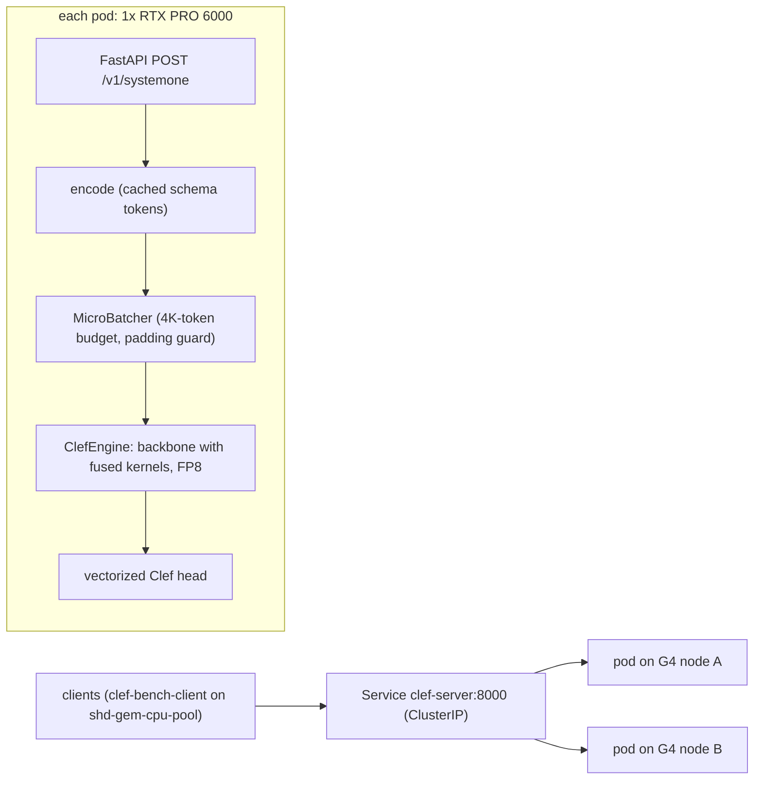

# Cloudflare Clef on GCP G4 (RTX PRO 6000)

Serving recipe, custom prefill engine and benchmarks for [Cloudflare/clef](https://huggingface.co/Cloudflare/clef), a 27B decision model, on GKE G4 (`g4-standard-48`, 1× RTX PRO 6000 Blackwell per node).

*Benchmarked October 7, 2026.*

## TL;DR

- **What Clef is.** It answers typed questions (`noul`, `choice`, `score`) about a state in one forward pass. There is no decoding, so the metric is input tokens/s, and one G4 GPU is compute-bound.
- **How it is served.** A custom prefill engine (the HF model plus fused Triton kernels and custom FP8 GEMMs) behind FastAPI. SGLang and vLLM do not expose the per-token hidden states the Clef head needs. Production runs 2 replicas, one per `g4-standard-48`.
- **Speed, FP8, per G4:**
  - **10.6K input tok/s**, 1.9–2.2× the reference implementation. That matches the SGLang FP8 backbone-only ceiling, with the head included.
  - A 1.5K-token request takes **147 ms** unloaded (reference: 266 ms).
  - About **7.4 mixed req/s per replica**. Two replicas scale 1.97×.
- **Accuracy.** FP8 is accuracy-neutral on BANKING77: 0.953 accuracy, 4 flips per 1,000 vs BF16.
- **NVFP4 MLP (opt-in).** +31% throughput through the server, −0.1 to −0.6 pt accuracy. Check it on your own eval set first.
- **Cost.** About **$0.15 per 1M input tokens** on-demand at 80% utilization (FP8).
- **Two serving bugs found and fixed:**
  - fla Triton autotune keys caused 2–6 s stalls on every new batch shape (§4.3).
  - A cold Triton cache still JIT-compiled a kernel on live traffic. `PAD_MULTIPLE=16` fixes it (§7.1).

## Quick start

### Deploy

The manifests target node pool `clef-g4-pool` (`g4-standard-48` with local SSD as ephemeral storage). Edit the `nodeSelector` for your cluster.

```bash
cd models/Clef

# Server code ships in a ConfigMap, mounted at /code in the pod
kubectl create configmap clef-server-code \
  --from-file=server/app.py --from-file=server/clef_engine.py --from-file=server/fast_patches.py \
  --from-file=server/fp8_linear.py --from-file=server/nvfp4_linear.py \
  --dry-run=client -o yaml | kubectl apply -f -

# 2 replicas (one per G4 node) + ClusterIP Service clef-server:8000
kubectl apply -f k8s/clef-server.yaml
kubectl rollout status deployment/clef-server
```

On a fresh node, the init container installs the Python packages and downloads the 52 GB of weights to the node's local SSD. After that, a pod is healthy about 25 s after it starts. `/health` returns 503 until model load and warmup finish.

### Send a request

```bash
kubectl port-forward svc/clef-server 8000:8000 &    # in-cluster: http://clef-server:8000

curl -s localhost:8000/health                        # {"status":"ok"}

curl -s localhost:8000/v1/systemone \
  -H 'Content-Type: application/json' \
  -d @- <<'EOF' | python3 -m json.tool
{
  "model": "clef",
  "state": "Hi, I was charged twice for my March invoice, and when I try to update my card the checkout page just times out so I can't pay. Please sort this out today.",
  "questions": {
    "department": {
      "type": "choice",
      "instructions": "Which team should handle this message?",
      "criteria": {
        "billing": "Payments, invoices, refunds or charges",
        "technical": "Bugs, errors or outages",
        "account": "Login, password or profile changes",
        "sales": "Pricing, plans or upgrades"
      }
    },
    "urgency": {
      "type": "score",
      "instructions": "How soon does the customer need a response?",
      "criteria": ["Can wait", "This week", "Today"]
    },
    "refund_requested": {
      "type": "noul",
      "instructions": "Is the customer asking for money back?"
    }
  }
}
EOF
```

Response (abridged):

```json
{
  "model": "clef",
  "answers": {
    "department": {"type": "choice", "choice": "billing", "confidence": 0.8815,
                   "probabilities": {"billing": 0.8815, "technical": 0.1065, "account": 0.0083, "sales": 0.0036}},
    "urgency": {"type": "score", "score": 1.9573, "confidence": 0.9649,
                "legend": {"0": "Can wait", "1": "This week", "2": "Today"},
                "probabilities": {"0": 0.0076, "1": 0.0275, "2": 0.9649}},
    "refund_requested": {"type": "noul", "noul": 0.0468}
  },
  "usage": {"input_tokens": 386, "output_tokens": 0}
}
```

| Question type | Request | Answer |
|---|---|---|
| `noul` | `instructions` | `noul`: P(true) |
| `choice` | `criteria`: `{option: description}` | `choice`, `confidence`, `probabilities` |
| `score` | `criteria`: list of levels, lowest first | `score` (expected level, 0…n-1), `confidence`, `legend`, `probabilities` |

- All questions are scored jointly in one pass. Test with the exact schema production sends.
- Wording drives decisions. In the request above, rewording `refund_requested` to "Would resolving this require refunding money to the customer?" moves P(true) from 0.047 to 0.692.
- Add `"debug": true` to a request to get timings and logits.

| Endpoint | Purpose |
|---|---|
| `POST /v1/systemone` | Decisions |
| `GET /health` | 503 until model load and warmup finish |
| `GET /stats`, `POST /stats/reset` | Counters (requests, batches, padding, GPU time, queue depth), live config, GPU memory |
| `POST /admin/config` | Runtime reconfiguration, used by the benchmark sweeps |

> [!CAUTION]
> `/admin/config` has no authentication and can reconfigure or quantize the live model. Keep the Service internal (ClusterIP) and never expose it publicly.

### Test decisions

[`tests/decisions/run_decisions.py`](./tests/decisions/run_decisions.py) checks Clef's decisions against labeled cases and prints a pass/fail report. A suite file holds the production question schema plus cases with expected answers. See the docstring for the format, and [`example_support_triage.yaml`](./tests/decisions/suites/example_support_triage.yaml) for every expectation form.

```bash
python3 tests/decisions/run_decisions.py tests/decisions/suites/example_support_triage.yaml
python3 tests/decisions/run_decisions.py tests/decisions/suites/*.yaml -v --out results/decisions.json
python3 run_decisions.py suite.yaml --url http://clef-server:8000      # from a pod in the cluster, e.g. clef-bench-client
```

The script uses only the standard library; YAML suites also need PyYAML. Exit status is 0 when every suite meets its `min_pass_rate`, 1 when one does not, and 2 on setup errors, so it can gate a CI job or a rollout.

```text
  question    type     passed    rate  conf ok  conf fail
  department  choice      7/7  100.0%     0.97          -
  urgency     score       5/5  100.0%     0.79          -
  outage      noul        6/6  100.0%     0.99          -
  PASS  7 cases: 7 passed, 0 failed, 0 errors, 0 xfail, 0 xpass | pass rate 100.0% (need 100%) | latency p50 268 ms, p95 342 ms

RESULT: PASS
```

### What's in this folder

| Path | Contents |
|---|---|
| [`server/app.py`](./server/app.py) | FastAPI server: `/v1/systemone`, `/health`, `/stats`, `/admin/config` |
| [`server/clef_engine.py`](./server/clef_engine.py) | Prefill engine: cached encoder, mask-free padded batches, vectorized head, micro-batcher |
| [`server/fast_patches.py`](./server/fast_patches.py) | Fused GDN, RMSNorm and MLP kernels; fla autotune-key pinning (§4.3) |
| [`server/fp8_linear.py`](./server/fp8_linear.py) | FP8 linear layers: one-pass Triton activation quantization + rowwise `torch._scaled_mm` |
| [`server/nvfp4_linear.py`](./server/nvfp4_linear.py) | NVFP4 (W4A4) MLP linear layers, opt-in (§6) |
| [`server/setup_env.sh`](./server/setup_env.sh) | One-time environment and weight setup inside a dev pod |
| [`k8s/clef-server.yaml`](./k8s/clef-server.yaml) | Production Deployment (2 replicas, FP8) and ClusterIP Service |
| [`k8s/dev-pod.yaml`](./k8s/dev-pod.yaml) | Dev pods, one per G4 node, for parity tests and in-process benchmarks |
| [`k8s/bench-client.yaml`](./k8s/bench-client.yaml) | Load-generator pod on the CPU pool |
| [`k8s/sglang-backbone-baseline.yaml`](./k8s/sglang-backbone-baseline.yaml), [`-fp8`](./k8s/sglang-backbone-baseline-fp8.yaml) | SGLang backbone-only speed reference (§3) |
| [`tests/decisions/`](./tests/decisions/) | Decision test harness and example suite |
| [`tests/`](./tests/) | Parity against the reference code (`parity.py`), kernel unit tests, shape-stall and NVFP4 probes |
| [`bench/`](./bench/) | Workload generator, load generator, engine benchmark, sweeps, accuracy eval, report tables |
| [`results/`](./results/) | Raw results behind the tables below (see [Raw results](#raw-results)) |

The dev-pod and SGLang manifests pin specific node hostnames from the benchmark cluster. Change them, or remove them, before applying.

### Reproducing the benchmarks

1. **Dev pod.** Apply [`k8s/dev-pod.yaml`](./k8s/dev-pod.yaml) and run [`server/setup_env.sh`](./server/setup_env.sh) inside it. Copy this folder to `/cache/code` and run the in-process scripts from there: `tests/parity.py`, `bench/bench_engine.py`, `bench/accuracy.py`.
2. **Workloads.** Generate them in the dev pod with `python bench/make_workloads.py --out /cache/workloads`. It needs the Clef tokenizer, and BANKING77 needs the dataset. The generated files (about 50 MB) are not checked in.
3. **Load client.** Apply [`k8s/bench-client.yaml`](./k8s/bench-client.yaml) and copy `bench/loadgen.py`, the `bench/*_bench.sh` scripts and the workloads to `/work` in the pod (`/work/workloads/*.jsonl`).
4. **Full deployment benchmark.** Run [`bench/final_orchestrate.sh`](./bench/final_orchestrate.sh) from a workstation: deploy FP8 ×2, bench, scale to ×1, bench, NVFP4 ×2, bench, restore FP8 ×2, fetch the results. Phase 1 deletes the dev pods to free the GPUs.

## 1. What Clef is and what that means for serving

Clef (`Cloudflare/clef`, Apache-2.0) is a "System 1" model. It answers a schema of questions (`noul`, `choice`, `score`) about a state in **one forward pass**. There is no decoding.

- **Backbone:** post-trained from Qwen3.8-27B (HF `qwen3_5` architecture), a hybrid of 48 Gated DeltaNet (linear attention) layers and 16 full-attention layers. It holds 24.4B non-embedding parameters, about 49 GFLOP per input token.
- **Head:** a 128M-parameter joint-schema head. It mean-pools question and option spans, cross-attends over **all** final hidden states, and scores every option.
- **Request layout:** `system prompt | STATE | SCHEMA | suffix`. The schema comes *after* the state, so prefix caching only covers the short system prompt.

What this changes compared with serving an LLM:

| LLM serving concern | Clef |
|---|---|
| Decode speed, KV-cache capacity | None. A request is one prefill, so no KV cache is needed. |
| Throughput metric | Input (prefill) tokens/s. A G4 is compute-bound at about 49 GFLOP per token. |
| Batching | Only needed to fill the GPU on short inputs. One request of 1.5K tokens or more already saturates an RTX PRO 6000. |
| Engine choice | The head needs the full `[T, 5120]` hidden-state matrix plus span metadata. vLLM/SGLang APIs do not expose that efficiently, so a custom prefill engine is used. SGLang serves as the backbone speed reference. |
| Latency | Grows linearly with input length; queueing dominates at high load. |

## 2. Setup

| Item | Value |
|---|---|
| Cluster | `shd-gem-cluster` (us-east5-a, `northam-ce-mlai-tpu`) |
| Node pool | `clef-g4-pool`: 2× `g4-standard-48` (1× RTX PRO 6000 Blackwell Server Edition 96 GB, SM 12.0, 48 vCPU), reservation `pm-g4-us-east5` |
| Node storage | 4× local SSD (ephemeral-storage RAID), weights + pip cache on a hostPath; 300 GB Hyperdisk Balanced boot |
| Load client | `clef-bench-client` on `shd-gem-cpu-pool` (isolated from the GPUs) |
| Software | PyTorch 2.11.0+cu130, transformers 5.10.2, flash-linear-attention 0.5.2, Triton 3.6.0, torchao 0.18.0; SGLang v0.5.21 for the backbone reference |
| Weights | 52 GB BF16. HF download took 48 s, model load takes about 10 s from local SSD |

Workloads come from [make_workloads.py](./bench/make_workloads.py). The text is templated synthetic text with realistic schemas, and lengths are calibrated with the Clef tokenizer (±20% jitter). BANKING77 is real data.

| Workload | Mean input tokens | Request |
|---|---|---|
| `short` | ~530 | chat-message moderation, 3 fields (noul + choice + score) |
| `medium` | ~1,530 | support-ticket triage, 5 fields |
| `long` | ~4,000 | contract review, 8 fields |
| `xlong` | ~15,800 | incident report, 4 fields (at the 16,384-token limit) |
| `mixed` | ~1,410 | 50% short, 35% medium, 15% long |
| `banking77` | ~1,834 | real BANKING77 test queries, one 77-way `choice` (also the accuracy set) |

## 3. Baselines

**Reference implementation** (`jsm.systemone` from the model repo, batch 1, on one G4):

| Workload | p50 latency | Throughput |
|---|---|---|
| short (535 tok) | 120 ms | 8.3 req/s, 4.4K tok/s |
| medium (1.5K) | 266 ms | 3.8 req/s, 5.7K tok/s |
| long (4K) | 707 ms | 1.4 req/s, 5.7K tok/s |
| xlong (15.8K) | 2,993 ms | 0.33 req/s, 5.3K tok/s |
| banking77 (1.8K) | 330 ms | 3.0 req/s, 5.6K tok/s |

**Speed reference: SGLang v0.5.21 backbone only** (the Clef backbone weights without the head, prefill with `max_new_tokens=1`; [sglang-backbone-baseline.yaml](./k8s/sglang-backbone-baseline.yaml), [sglang-backbone-baseline-fp8.yaml](./k8s/sglang-backbone-baseline-fp8.yaml), [sweep_sglang.sh](./bench/sweep_sglang.sh)):

| Precision | Peak throughput | c=1 p50, medium |
|---|---|---|
| BF16 | ~6.9K tok/s | 259 ms |
| FP8 (dynamic, per-token) | ~10.6K tok/s | 173 ms |

SGLang is used as a ceiling, not as the server: it does not return the per-token hidden states and span metadata the Clef head needs.

## 4. Optimization ladder

### 4.1 Engine level (in-process, no HTTP)

Measured with [bench_engine.py](./bench/bench_engine.py). Each cell is one full forward pass (backbone plus head) for `tokens × batch`.

| Step | 512×1 | 1536×1 | 4096×1 | 16384×1 | 1536×8 | tok/s at 1536×8 | Peak GPU memory |
|---|---|---|---|---|---|---|---|
| Engine, HF + fla eager, BF16 | 100 ms | 268 ms | 718 ms | 3,092 ms | 2,183 ms | 5.6K | 55–65 GB |
| + torchao FP8 dynamic rowwise (rejected) | 131 ms | ~240 ms | | | 2,352 ms | 5.2K | |
| Fused kernels, BF16 | 81 ms | 222 ms | 590 ms | 2,551 ms | 1,780 ms | 6.9K | 55–65 GB |
| **Fused + custom FP8 (production)** | **53.7 ms** | **142 ms** | **384 ms** | **1,695 ms** | **1,164 ms** | **10.6K** | **31 GB** |
| Fused + NVFP4 MLP (opt-in, §6) | 60.6 ms | 108 ms | 289 ms | 1,335 ms | 892 ms | 13.8K | 23–26 GB |

What each step does:

1. **Engine, eager BF16.** The same HF model as the reference, called with batched, right-padded inputs and no attention mask, plus a vectorized head. Dropping the mask is exact for right padding: attention, the GDN recurrence, and the causal conv only look backwards, so trailing pads never reach valid tokens. The engine's reference path is bit-identical to `ClefModel.forward`.
2. **torchao FP8 (rejected).** GEMM time drops from 1,409 to 771 ms, but unfused activation quantization adds about 800 ms, so end to end it is slower than BF16.
3. **Fused kernels** ([fast_patches.py](./server/fast_patches.py), +23%):
   - Merged GDN input projections (qkv+z in one GEMM, b+a in another).
   - fla Triton causal conv on the `[B, T, C]` layout, replacing transposes and a cuDNN depthwise conv.
   - Native grouped-value attention in fla `chunk_gated_delta_rule`, so q/k are no longer repeated to 48 heads.
   - fla fused GDN gate.
   - Single-pass Triton RMSNorm for the zero-centred `(1 + w)` weight.
   - Merged `gate_up` GEMM with a Triton SiLU·mul.
4. **Custom FP8** ([fp8_linear.py](./server/fp8_linear.py), +53% over fused BF16):
   - One-pass Triton per-token activation quantization.
   - Per-channel FP8 weights.
   - cuBLASLt rowwise `torch._scaled_mm` at about 740 TF/s.
   - It reaches the SGLang FP8 backbone ceiling (~10.6K tok/s) *including* the head, and halves memory.

### 4.2 Where the time goes

Profile of eager BF16 at 1536×8 (12,288 tokens, 2,183 ms), from [profile_forward.py](./bench/profile_forward.py):

| Category | Time | Share |
|---|---|---|
| GEMMs (SM80-style CUTLASS/cuBLAS BF16 kernels, ~425 TF/s) | 1,409 ms | 65% |
| Elementwise, norms, casts (unfused) | 554 ms | 25% |
| GDN chunk kernels (fla) | 131 ms | 6% |
| Depthwise conv1d | 59 ms | 3% |
| Flash attention (16 layers) | 13 ms | <1% |

- BF16 GEMMs already run at about 84% of the GPU's dense BF16 peak, so kernel tuning cannot do much for them. The levers are fusion (the 25% elementwise share) and lower precision.
- Measured GEMM rates on this GPU: BF16 ~400–425 TF/s, FP8 rowwise ~740 TF/s, NVFP4 block-scaled ~1.4 PF/s.
- Attention is negligible at these lengths. Prefill cost is dominated by the dense projections and the MLP, which holds about 70% of the FLOPs.

### 4.3 Multi-second stalls on new batch shapes (found and fixed)

**Symptom.** The first HTTP ladder showed multi-second latency spikes whenever the micro-batcher produced a batch shape it had not seen before. The spikes hit configs B, C, D, F and G32 at 8 or more concurrent requests.

**Root cause.** Several fla Triton kernels use shape-derived `tl.constexpr` arguments as autotune keys, even though the kernel body never reads them:

| Kernel | Autotune key |
|---|---|
| `chunk_local_cumsum` | `B` (batch size) |
| `causal_conv1d_fwd_kernel` | `NB = cdiv(B·T, 1024)` |
| `l2norm` | `NB = cdiv(rows, 65536)` |
| `layer_norm_gated_fwd_kernel` | `NB` |

Every new value triggers a JIT recompile plus a full autotune sweep, costing 2–6 s per kernel. A serving engine with variable batch sizes and lengths keeps producing new values.

**Fix.** `fast_patches.pin_autotune_keys()` pins those arguments to a constant.
- It patches 17 kernels.
- It only pins a key after parsing the kernel source and confirming that the body never references it, so numerics are unchanged.
- The tuned configs are chosen once, during warmup, on a throughput-sized batch.

**Result** ([shape_stall_probe.py](./tests/shape_stall_probe.py), 40 unseen shapes, fused + FP8):

| | Stalls | Excess time | Worst stall | Autotune events | Init + warmup |
|---|---|---|---|---|---|
| fla as shipped | 15 | 63.8 s | 12.1 s | 50 | 83 s |
| Pinned keys | 1 (151 ms) | 0.09 s | 0.15 s | 9 (all during warmup) | 44 s |

> [!TIP]
> This applies to any server that runs fla kernels on variable batch shapes, not only Clef. It is worth upstreaming to flash-linear-attention.

### 4.4 HTTP ladder (one replica, through the server)

Setup:
- One server process on one G4, reconfigured between steps through `/admin/config` ([sweep_clef.sh](./bench/sweep_clef.sh)).
- Closed-loop clients on the CPU pool ([loadgen.py](./bench/loadgen.py)).
- Every row runs with pinned autotune keys (ladder v2).
- Peak throughput is the best level over c = 1…64.

| Config | Change | medium peak | mixed peak | short peak | medium c=1 p50 | medium c=16 p50 / p95 | mixed c=64 p95 |
|---|---|---|---|---|---|---|---|
| A | Engine BF16, reference head, attention mask, one request at a time | 5.70K | 5.45K | 4.72K | 282 ms | 4,405 / 5,618 ms | 21.3 s |
| B | + dynamic batching (≤16K tokens, ≤64 requests) | 5.62K | 5.29K | 5.02K | 286 ms | 5,201 / 5,829 ms | 33.7 s |
| C | + vectorized head | 5.65K | 5.34K | 5.07K | 285 ms | 5,164 / 5,466 ms | 31.7 s |
| D | + no attention mask, padding guard (≥80% real tokens per batch) | 5.65K | 5.48K | 5.19K | 285 ms | 4,969 / 5,286 ms | 29.8 s |
| F | + fused kernels | 6.61K | 6.47K | 6.28K | 246 ms | 4,067 / 4,330 ms | 24.2 s |
| G | + custom FP8, 16K-token budget | 10.58K | 10.19K | 9.80K | 151 ms | 2,612 / 3,033 ms | 15.7 s |
| G8 | FP8, 8K budget | 10.58K | 10.28K | 10.28K | 151 ms | 2,133 / 3,586 ms | 16.3 s |
| **G4** | **FP8, 4K budget (production)** | **10.68K** | **10.53K** | **10.40K** | **151 ms** | **2,317 / 3,338 ms** | **14.4 s** |
| G32 | FP8, 32K budget | 10.57K | 10.16K | 9.70K | 151 ms | 2,878 / 2,985 ms | 17.2 s |

Throughput is input tokens/s.

**A → G4 on one GPU:**
- Throughput: medium 1.87×, mixed 1.93×, short 2.20×.
- Single-request latency: medium 282 → 151 ms, short 121 → 72 ms.
- The HTTP path adds about 9 ms over the in-process engine (142 ms for 1536×1).

What the ladder shows:
- **Batching alone adds nothing for inputs of 1.5K tokens or more.** One request already fills the GPU.
  - Batching only helps short inputs (+10% by step D).
  - Without the padding guard (B, C), mixed traffic *loses* throughput: at c=16 it drops from 5.45K to 3.4K tok/s, because short requests are padded to the longest request in the batch.
  - Batch formation also reorders requests, which hurts the tail at high concurrency in the BF16 configs.
- **Fused kernels:** +16–21% throughput, −13% latency.
- **FP8:** +60% throughput, −39% latency.
- **A small token budget wins** because FP8 saturates the GPU at roughly 1.5–3K tokens per batch:
  - 4K had the highest throughput at every concurrency of 8 or more on all three workloads, and the best p99 at c ≥ 32. For medium at c=64, p99 was 12.8 s vs 16.1 s (8K) and 19.6 s (16K).
  - Server-side stats show the GPU about 100% busy in every FP8 config, so the differences are per-token efficiency.
  - With 4K, batches carry about 3–3.6K real tokens at ≥99% padding efficiency under load. With 16K and 32K, batches carry 7–15% padding.
  - Batches over about 16K tokens also run about 25% slower per padded token. G32 took 3.1 s for 25K padded tokens vs 1.3 s for 14K. I did not chase the root cause because the 4K budget avoids it. So 32K is clearly worse: about 7.4K tok/s at c=64.
  - The trade-off: smaller batches give a lower median but a wider p50–p99 spread at mid concurrency (medium c=8: 1,060 / 1,966 ms with 4K vs 1,281 / 1,416 ms with 8K).

**Effect of the autotune fix at the HTTP level** (same configs, before and after pinning):

| Config and level | Ladder v1 (fla as shipped) | Ladder v2 (pinned keys) |
|---|---|---|
| B, medium c=16 p95 | 12,983 ms | 5,829 ms |
| F, medium c=16 p95 | 7,788 ms | 4,330 ms |
| G32, medium c=16 p50 / p95 | 4,907 / 9,015 ms | 2,878 / 2,985 ms |
| G32, mixed c=64 p95 | 29.5 s | 17.2 s |

In v1, the G and G8 rows looked clean only because the F run had already compiled most of their batch shapes. A freshly started production pod would have hit the stalls on live traffic.

### 4.5 Numerical parity

Checked with [parity.py](./tests/parity.py):

| Comparison | Result |
|---|---|
| Engine reference path vs `ClefModel.forward` | bit-identical |
| Batched + no mask + vectorized head vs reference | 99/99 argmax agreement |
| Fused BF16 vs reference | 99/99 argmax agreement |
| Fused + FP8 vs reference | 97/99 argmax agreement, max Δp 0.16 |

## 5. Accuracy and calibration (BANKING77)

1,000 queries from the BANKING77 test set, each a single 77-way `choice` ([accuracy.py](./bench/accuracy.py)). Flips are paired prediction changes against engine BF16 on the same queries.

| Variant | Accuracy | Macro-F1 | NLL | Brier | ECE | Flips vs BF16 | Engine tok/s |
|---|---|---|---|---|---|---|---|
| Reference `systemone` (200-query subset) | 0.950 | 0.9395 | 0.2463 | 0.0946 | 0.0431 | | |
| Engine BF16 | 0.953 | 0.9529 | 0.1946 | 0.0783 | 0.0436 | (0/200 vs reference) | 5,510 |
| Fused BF16 | 0.953 | 0.9530 | 0.1946 | 0.0784 | 0.0451 | 2 | 6,768 |
| **Fused + FP8 (default)** | **0.953** | **0.9523** | **0.1952** | **0.0794** | **0.0458** | **4** (0/200 vs reference) | **10,556** |
| Fused + NVFP4 MLP, all 64 layers | 0.947 | 0.9457 | 0.2040 | 0.0822 | 0.0484 | 15 | 13,505 |
| Fused + NVFP4, `gate_up` only | 0.946 | 0.9451 | 0.2032 | 0.0831 | 0.0438 | 11 | 12,433 |
| Fused + NVFP4 MLP, layers 8–55 | 0.952 | 0.9521 | 0.2042 | 0.0830 | 0.0495 | 9 | 12,596 |

- The reference row covers a 200-query subset because the reference implementation is slow. On those 200 queries, engine BF16 and FP8 both make exactly the reference's predictions.
- At n=1,000 the standard error of accuracy is about 0.7 points, so paired flips and NLL are the more sensitive signals.
- **FP8 is accuracy-neutral:** 4 flips out of 1,000, same accuracy, NLL +0.0006.
- **NVFP4 is a small but real shift:** 9–15 flips, NLL +0.009, and slightly worse calibration (ECE +0.003 to +0.004).

## 6. NVFP4 (W4A4) for the MLP: opt-in

**Why.** FP4 tensor cores on SM120 run block-scaled GEMMs at about 1.4 PF/s, 1.85× FP8. The MLP is about 70% of Clef's FLOPs.

**Why custom.** torchao's NVFP4 path does not work on this stack:
- Its Triton kernel needs the `mslk` library, which is not available.
- Its unfused fallback is slower than BF16 (12.1 ms vs 10.6 ms for the probe GEMM).

**Implementation** ([nvfp4_linear.py](./server/nvfp4_linear.py)):
1. A Triton per-tensor amax kernel (atomic max, no host sync).
2. A Triton quantizer that produces:
   - 1×16 blocks with e4m3 block scales under a global scale `g = 2688 / amax`;
   - e2m1 values packed two per byte;
   - scales written directly in cuBLASLt's 128×4 swizzled layout.
3. `torch._scaled_mm` with `float4_e2m1fn_x2` operands (cuBLASLt block-scaled FP4 GEMM).
4. The `gate_up` output scale is folded into the SiLU·mul kernel. That kernel also emits amax(h) for the `down` projection's quantizer.
5. Weights are quantized once at load time. Attention, GDN projections and the head stay on FP8 or BF16.

Unit test ([test_nvfp4.py](./tests/test_nvfp4.py)) against an independent decode: relative error 0.0025–0.0039, so layout, nibble order and scales are correct.

**Speed, in-process engine** (one forward pass):

| Shape | FP8 | NVFP4 MLP | Speed-up |
|---|---|---|---|
| 512×1 | 53.7 ms | 60.6 ms | 0.89× |
| 1536×1 | 142 ms | 108 ms | 1.31× |
| 4096×1 | 384 ms | 289 ms | 1.33× |
| 16384×1 | 1,695 ms | 1,335 ms | 1.27× |
| 1536×8 | 1,164 ms | 892 ms | 1.30× |
| 1536×8, layers 8–55 only | 1,164 ms | 955 ms | 1.22× |

**Speed through the deployed server** (2 replicas, same benchmark as §7):

| Metric | FP8 | NVFP4 MLP | Change |
|---|---|---|---|
| short (530 tok), c=1 p50 | 73 ms | 62 ms | −15% |
| medium (1.5K), c=1 p50 | 147 ms | 115 ms | −22% |
| xlong (15.8K), c=1 p50 | 1,644 ms | 1,321 ms | −20% |
| medium, peak tok/s | 21.1K | 27.6K | +31% |
| mixed, peak tok/s | 20.9K | 27.3K | +31% |

- Most of the gain comes from the GEMMs themselves: `gate_up` 4.72 vs 5.76 ms, `down` 2.40 vs 3.34 ms, quantization included.
- Through the server, NVFP4 is faster at every input size, including 530-token requests. The in-process 512×1 result (slower than FP8) was the first shape of that run. I did not re-measure it, and the server numbers are the ones that matter.

At the same offered load (open loop, mixed, 2 replicas), the extra headroom shows up as much lower tail latency:

| Offered | FP8: p50 / p95 / p99 | NVFP4: p50 / p95 / p99 |
|---|---|---|
| 5 req/s | 148 / 560 / 784 ms | 103 / 357 / 443 ms |
| 9 req/s | 189 / 698 / 954 ms | 117 / 421 / 602 ms |
| 12 req/s | 401 / 1,114 / 1,380 ms | 147 / 559 / 808 ms |
| 14 req/s | 752 / 2,075 / 2,676 ms | 222 / 700 / 837 ms |
| 17 req/s | overloaded: 14.3 req/s achieved, p50 3.7 s | 16.2 achieved, 434 / 1,373 / 1,838 ms |

**Quality** (from §5): all layers −0.6 pt accuracy and 15 flips per 1,000; layers 8–55 −0.1 pt and 9 flips, keeping +19% of the gain.

> [!IMPORTANT]
> Use NVFP4 only after checking it on your own task-specific eval set. To enable it, set `QUANT=nvfp4_mlp` on the Deployment. For the balanced variant, also set `NVFP4_LAYERS='^layers\.([89]|[1-4][0-9]|5[0-5])\.mlp$'`.

## 7. Production deployment

**What runs** ([clef-server.yaml](./k8s/clef-server.yaml)):



- `Deployment/clef-server`: 2 replicas with required anti-affinity, so there is one pod per G4 node and per GPU. Settings: `QUANT=fp8_fast`, `FUSED=1`, `PIN_AUTOTUNE=1`, `MAX_BATCH_TOKENS=4096`, `MIN_PAD_EFF=0.8`.
- Code ships in the `clef-server-code` ConfigMap. Weights (52 GB), Python packages and the Triton kernel cache live on a hostPath on each node's local-SSD RAID. On a fresh node, an init container fills it (HF download 48 s).
- `/health` returns 503 until model load and warmup finish. Measured on the deployed pods:
  - Model load: 9.7 s.
  - Warmup: 5 s with a warm Triton cache, 34 s on a cold one.
  - From pod start to healthy: about 25 s on a warm node.

**Unloaded latency** (c=1, through the Service, FP8):

| Workload | Reference `systemone` | Deployed | Speed-up |
|---|---|---|---|
| short (530 tok) | 120 ms | 73 ms | 1.64× |
| medium (1.5K) | 266 ms | 147 ms | 1.81× |
| banking77 (1.8K) | 330 ms | 175 ms | 1.89× |
| long (4K) | 707 ms | 389 ms | 1.82× |
| xlong (15.8K) | 2,993 ms | 1,644 ms | 1.82× |

**Scale-out, 1 → 2 replicas** (closed loop, peak throughput):

| Workload | 1 replica | 2 replicas | Scaling |
|---|---|---|---|
| medium | 10.7K tok/s · 7.0 req/s | 21.1K tok/s · 13.8 req/s | 1.97× |
| mixed | 10.6K · 7.5 req/s | 20.9K · 14.5 req/s | 1.97× |
| banking77 | 10.7K · 5.8 req/s | 21.1K · 11.5 req/s | 1.97× |
| long | 10.6K · 2.7 req/s | 20.4K · 5.1 req/s | 1.92× |

**Open loop** (Poisson arrivals, mixed workload, 60 s per rate; utilization = offered rate / measured capacity):

| Utilization | 1 replica: offered → p50 / p95 / p99 | 2 replicas: offered → p50 / p95 / p99 |
|---|---|---|
| ~35% | 2.5 req/s → 150 / 527 / 871 ms | 5 req/s → 148 / 560 / 784 ms |
| ~60% | 4.5 → 240 / 878 / 1,320 ms | 9 → 189 / 698 / 954 ms |
| ~80% | 6 → 453 / 1,381 / 1,859 ms | 12 → 401 / 1,114 / 1,380 ms |
| ~95% | 7 → 1,045 / 2,411 / 2,842 ms | 14 → 752 / 2,075 / 2,676 ms |
| overload (115%) | 8.5 → achieved 7.35 req/s, p50 4.8 s | 17 → achieved 14.3 req/s, p50 3.7 s |

- Capacity on the mixed workload is about **7.4 req/s per replica**. Two replicas reached 14.3 req/s, which is 1.95×.
- The p95 includes the 15% of mixed requests that are 4K-token contract reviews (about 390 ms each unloaded). Short requests alone stay much lower.

**Two effects visible in the deployment runs:**
1. **Per-connection balancing.** kube-proxy assigns each TCP connection to one pod, and the load generator keeps connections alive.
   - In the NVFP4 run, medium c=4 reached only a single replica's throughput (13.4K tok/s vs about 27K possible). That is consistent with all 4 connections landing on one pod, which happens 1 time in 8.
   - With only 4 connections, xlong c=4 on FP8 reached 15.5K instead of about 19K.
   - Fix: request-level, least-loaded balancing (§9).
2. **First-traffic JIT compile on a cold node.** On the node whose Triton cache was cold, the first short c=16 level ran at 6.8K tok/s with a 2.5 s max latency. The node's Triton cache shows exactly one kernel compiled after warmup during that level: `causal_conv1d_fwd_kernel` at 09:45:07.
   - That fla kernel takes `B` and `T` as plain integers, and Triton compiles a separate variant depending on whether they are divisible by 16.
   - Pinning autotune keys does not cover this case. See §7.1.

### 7.1 Cold-node JIT compiles (found and fixed)

**Why pinning was not enough.** Pinning autotune keys (§4.3) removed the autotune sweeps. A pod with an empty Triton cache could still compile a kernel on live traffic, for a different reason:
- Triton builds a separate binary for each *specialization* of integer arguments (equal to 1, divisible by 16, or other).
- fla's `causal_conv1d_fwd_kernel` takes the batch size `B` and length `T` as plain integers.
- So the first batch whose padded length happens to be a multiple of 16 needs a new binary, unless warmup happened to produce one. The compile blocks the GPU thread for up to a couple of seconds.

**Fix.** `PAD_MULTIPLE=16` rounds each batch's padded length up to a multiple of 16.
- It is exact for the same reason dropping the mask is exact.
- `T` and `B·T` are then always multiples of 16, and warmup already covers every batch-size class (1, 16, other).

**Experiment** ([cold_jit_experiment.sh](./bench/cold_jit_experiment.sh)): fresh Triton cache, 1 replica, identical traffic (mixed c=1–64, short c=4–64, medium c=2–8):

| | `PAD_MULTIPLE=1` | `PAD_MULTIPLE=16` |
|---|---|---|
| Kernels compiled on live traffic, after warmup | 1 (`causal_conv1d_fwd_kernel`, during mixed c=4) | **0** |
| mixed c=4: tok/s, p99 | 8.43K, 1,293 ms | 10.31K, 786 ms |
| Saturated tok/s (mixed / short / medium) | 10.65K / 10.63K / 10.52K | 10.62K / 10.56K / 10.54K |
| Answers vs `PAD_MULTIPLE=1` (150 BANKING77 + 50 medium requests) | | 400/400 fields same argmax, max abs Δp 0.0027 |

- The cost is about 1% on short requests, which carry 7.5 extra pad tokens on average out of 530.
- `PAD_MULTIPLE=16` is set in the deployed manifest.
- Shipping a pre-populated Triton cache in the image (§9) is a second, complementary safeguard.

## 8. Capacity and cost

Capacity of one G4 (`g4-standard-48`, 1× RTX PRO 6000), measured through HTTP:

| Configuration | Input tok/s | mixed req/s | medium req/s | long req/s |
|---|---|---|---|---|
| Reference-equivalent (step A) | 5.5–5.7K | 3.9 | 3.7 | ~1.4 |
| Fused BF16 (step F) | 6.5–6.6K | 4.6 | 4.3 | |
| **FP8 (deployed)** | **10.6K** | **7.4** | **7.0** | **2.7** |
| NVFP4 MLP (opt-in) | 13.7K | 9.5 | 9.0 | |

**Cost per 1M input tokens.** Assumed prices for g4-standard-48 are third-party estimates, so check your own pricing:

| | On-demand ($4.50/h) | 1-yr CUD ($3.11/h) | 3-yr CUD ($1.98/h) |
|---|---|---|---|
| Reference-equivalent, 5.7K tok/s, 80% util | $0.27 | $0.19 | $0.12 |
| **FP8, 10.6K tok/s, 80% util** | **$0.15** | **$0.10** | **$0.065** |
| FP8, 100% util | $0.12 | $0.082 | $0.052 |
| NVFP4, 13.7K tok/s, 80% util | $0.11 | $0.079 | $0.050 |

- 80% utilization is the planning point: open-loop p99 at that load was about 1.4 s for 2 replicas and 1.9 s for 1 replica on the mixed workload.
- On-demand at 80% utilization, a mixed request (1.41K tokens) costs about $0.21 per 1,000 requests with FP8.
- The reservation `pm-g4-us-east5` is billed whether or not the nodes run pods. The real marginal cost is set by how many reserved VMs you hold.

**Sizing example.** 1M mixed requests per day is 11.6 req/s on average. Assume peaks of 2× (23 req/s) and plan each replica at 80% of capacity:
- FP8: 5.9 req/s per replica, so 4 replicas.
- NVFP4: 7.6 req/s per replica, so 3 replicas, running at about 81%.
- Add one replica for N+1 availability.

## 9. Recommendations

**Keep the deployed configuration.**
- One replica per `g4-standard-48` (1× RTX PRO 6000).
  - FP8 Clef needs about 31 GB, so tensor parallelism or larger GPUs buy nothing. Scale out by adding replicas.
  - On multi-GPU G4 shapes, run one replica per GPU.
- Settings: `FUSED=1`, `QUANT=fp8_fast`, `PIN_AUTOTUNE=1`, `MAX_BATCH_TOKENS=4096`, `MIN_PAD_EFF=0.8`.
- FP8 is accuracy-neutral, so there is no reason to serve BF16.

**Before taking production traffic:**
1. **Request-level load balancing.** A ClusterIP Service balances per TCP connection. A few long-lived keep-alive clients can pin most of the traffic on one replica.
   - Prefer an L7 proxy with least-outstanding-requests balancing, for example Envoy or a Cloud Service Mesh `DestinationRule` with `LEAST_REQUEST`.
   - GKE Inference Gateway is another option, but only once the server exports the queue metrics its endpoint picker reads.
2. **Autoscale on queue depth, not GPU utilization.** One 1.5K-token request already drives the GPU to 100%. Export in-flight requests and queue depth from the server (it has `/stats`; add a Prometheus `/metrics`). Then scale with HPA through Managed Prometheus, targeting about 70–80% of the capacity in §8.
3. **Packaging.**
   - Bake the Python dependencies and a pre-populated Triton cache into the image instead of pip-installing into the node cache. Warmup is then about 5 s.
   - Serve weights from Hyperdisk ML (read-only, shared across nodes) or from the image. Model load is only about 10 s from local SSD; the remaining startup time is imports and warmup.
4. **Availability.**
   - Keep at least 2 replicas and add a PodDisruptionBudget (`minAvailable: 1`).
   - The manifest now uses `RollingUpdate` with `maxSurge: 0, maxUnavailable: 1`, so one replica keeps serving during config changes.
   - The reservation (`pm-g4-us-east5`) is billed whether or not the nodes are used.
5. **Very long inputs.** A 16K-token request occupies its GPU for about 1.65 s, and short requests on that replica queue behind it. If short requests have a tight SLO and traffic includes many 16K inputs, route long inputs to a separate replica pool.
6. **NVFP4 stays opt-in.** Enable it only after a task-specific eval. Prefer the layers 8–55 variant.

**Future work, by expected gain:**
1. NVFP4 for the attention and GDN projections, and fusing activation quantization into the preceding norm or activation kernel. Expected gain: roughly another 10–15% if quality holds. This needs an accuracy check.
2. CUDA graphs for small batches. A 530-token request takes 73 ms through HTTP, while its FP8 GEMMs need only about 35 ms. Part of that gap is probably per-kernel launch overhead, which graphs remove. This is not measured yet.
3. Upstream the fla autotune-key fix (§4.3).
4. Investigate why batches over 16K tokens slow down per token. Not needed at the 4K budget.
5. A hidden-states-plus-head integration in SGLang or vLLM, to reuse their schedulers and kernels as they gain SM120 optimizations.

## Raw results

| File | Section |
|---|---|
| [`sglang-bf16.jsonl`](./results/sglang-bf16.jsonl), [`sglang-fp8.jsonl`](./results/sglang-fp8.jsonl) | §3 SGLang backbone reference |
| [`engine_bench.jsonl`](./results/engine_bench.jsonl), [`engine_bench_deva.jsonl`](./results/engine_bench_deva.jsonl) | §3 reference `systemone` timings, §4.1 engine benchmarks |
| [`engine_bench_devb.jsonl`](./results/engine_bench_devb.jsonl) | §6 NVFP4 engine timings |
| [`profile.jsonl`](./results/profile.jsonl) | §4.2 kernel profile |
| [`stall_probe.jsonl`](./results/stall_probe.jsonl) | §4.3 shape-stall probe |
| [`clef_ablation.jsonl`](./results/clef_ablation.jsonl) (v1), [`clef_ablation_v2.jsonl`](./results/clef_ablation_v2.jsonl), [`server_v2.log`](./results/server_v2.log) | §4.4 HTTP ladder |
| [`parity_bf16.json`](./results/parity_bf16.json), [`parity_fused_fp8.json`](./results/parity_fused_fp8.json) | §4.5 numerical parity |
| [`accuracy.jsonl`](./results/accuracy.jsonl) | §5 BANKING77 accuracy |
| [`final.jsonl`](./results/final.jsonl), [`final_fp8_2rep.log`](./results/final_fp8_2rep.log), [`final_fp8_1rep.log`](./results/final_fp8_1rep.log), [`final_nvfp4_2rep.log`](./results/final_nvfp4_2rep.log) | §6–§7 deployment benchmarks |
| [`cold_jit.jsonl`](./results/cold_jit.jsonl) | §7.1 cold-node JIT experiment |

Turn loadgen results into tables with [report_tables.py](./bench/report_tables.py), for example `python3 bench/report_tables.py final results/final.jsonl`.
