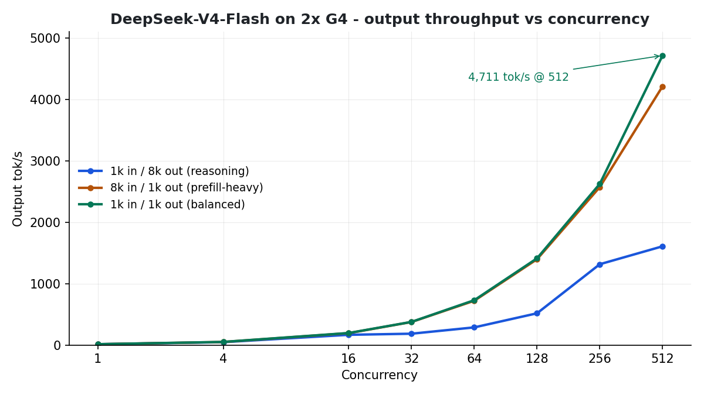

# DeepSeek-V4-Flash-0731

SGLang serving recipes and benchmarks for **`deepseek-ai/DeepSeek-V4-Flash-0731`** (released July 31, 2026) on **GCP G4 nodes** (`g4-standard-384`, 8× or 16× NVIDIA RTX PRO 6000 Blackwell, 96 GB each) in both **single-node (8 GPUs)** and **2-node (16 GPUs)** configurations.

## Highlights

- **Single-Node Peak 6,122 tok/s**: Delivers **3,880.89 output tok/s** (6,122.00 peak) at concurrency 512 on `1k/8k` reasoning on a single 8× RTX PRO 6000 host, scaling smoothly from C=64 (1,440.93 tok/s).
- **2-Node Scaling**: **4,710.94 output tok/s** at concurrency 512 on the balanced `1k/1k` workload with throughput still climbing at 512 streams.
- **Zero Boot Disk Pressure**: Weight ingestion via dedicated 500 GB Hyperdisk Balanced volume (`dsv4-flash-hyperdisk-balanced`) protects the G4 node's 94 GB boot disk from eviction.
- **Sub-second TTFT through concurrency 256** for 1K prompts (940.8 ms on 2-node; ~1.6–2.8 s on 1-node).
- **100% success rate** (0 failed requests) at every concurrency level, 1 → 512, across all evaluated workloads.

---

## Single-Node (8× RTX PRO 6000) Serving & 1K/8K Benchmarks

DeepSeek-V4-Flash-0731 is served on a **single node** (8× NVIDIA RTX PRO 6000 GPUs, `TP=8`, `DP=8` attention) mounted to a dedicated 500 GB Hyperdisk Balanced volume (`dsv4-flash-hyperdisk-balanced`) to prevent boot disk pressure and eliminate re-download stalls.

### Single-Node Configuration

| Item | Value |
|------|-------|
| Model | `deepseek-ai/DeepSeek-V4-Flash-0731` |
| Hardware | 1× `g4-standard-384` (8× RTX PRO 6000, 96 GB each) |
| Parallelism | TP=8 · DP=8 with `--enable-dp-attention` |
| Storage | 500 GB Hyperdisk Balanced mounted at `/models/DeepSeek-V4-Flash-0731` |
| MoE runner | `flashinfer_mxfp4` |
| KV cache | `fp8_e4m3` |
| Image | `lmsysorg/sglang:dev-cu13` |
| Context length | 131,072 |
| Manifest | [`sglang-dsv4-flash-1node-hdml.yaml`](./sglang-dsv4-flash-1node-hdml.yaml) |

Key launch flags (full manifest: [`sglang-dsv4-flash-1node-hdml.yaml`](./sglang-dsv4-flash-1node-hdml.yaml)):

```bash
python3 -m sglang.launch_server \
  --model-path /models/DeepSeek-V4-Flash-0731 \
  --trust-remote-code \
  --tensor-parallel-size 8 \
  --dp-size 8 \
  --enable-dp-attention \
  --moe-runner-backend flashinfer_mxfp4 \
  --kv-cache-dtype fp8_e4m3 \
  --disable-custom-all-reduce \
  --mem-fraction-static 0.85 \
  --cuda-graph-max-bs-decode 32 \
  --max-running-requests 768 \
  --chunked-prefill-size 16384 \
  --context-length 131072 \
  --page-size 256 \
  --enable-mixed-chunk \
  --reasoning-parser deepseek-v3 \
  --tool-call-parser deepseekv32 \
  --enable-metrics \
  --host 0.0.0.0 --port 30000
```

### 1K / 8K Reasoning Concurrency Sweep (Single-Node)

Benchmarked with `sglang.bench_serving` from the cluster's isolated CPU pool (`shd-gem-cpu-pool`):

| Concurrency | Output tok/s | Peak tok/s | Mean TTFT | Mean TPOT | Avg Latency | Completed Req |
|:---:|:---:|:---:|:---:|:---:|:---:|:---:|
| **64** | 1,440.93 | — | 1,663.9 ms | 33.98 ms | 148.99 s | 32 / 32 (100%) |
| **128** | 2,230.09 | — | 1,982.0 ms | 41.78 ms | 165.03 s | 48 / 48 (100%) |
| **256** | 2,676.52 | 4,474.00 | 2,892.7 ms | 82.89 ms | 324.25 s | 128 / 128 (100%) |
| **512** | 3,880.89 | 6,122.00 | 10,460.8 ms | 88.71 ms | 346.16 s | 256 / 256 (100%) |

---

## Two-Node (16× RTX PRO 6000) Serving & Full Sweep

Served across 2 nodes (`g4-standard-384`, 16× RTX PRO 6000 GPUs) using pipeline parallelism (`PP=2`) and tensor parallelism (`TP=8`).

### Two-Node Configuration

| Item | Value |
|------|-------|
| Model | `deepseek-ai/DeepSeek-V4-Flash-0731` |
| Hardware | 2× `g4-standard-384` (16× RTX PRO 6000, 96 GB each) |
| Parallelism | TP=8 · PP=2 · DP=8 with `--enable-dp-attention` |
| MoE runner | `flashinfer_mxfp4` |
| KV cache | `fp8_e4m3` |
| Image | `lmsysorg/sglang:dev-cu13` |
| Context length | 131,072 |
| Manifest | [`sglang-dsv4-flash-2node.yaml`](./sglang-dsv4-flash-2node.yaml) |

Key launch flags (full manifest: [`sglang-dsv4-flash-2node.yaml`](./sglang-dsv4-flash-2node.yaml)):

```bash
python3 -m sglang.launch_server \
  --model-path deepseek-ai/DeepSeek-V4-Flash-0731 --trust-remote-code \
  --tensor-parallel-size 8 --pipeline-parallel-size 2 --dp-size 8 --enable-dp-attention \
  --nnodes 2 --node-rank $POD_INDEX --dist-init-addr sglang-dsv4-flash-master:5000 \
  --moe-runner-backend flashinfer_mxfp4 --kv-cache-dtype fp8_e4m3 \
  --disable-custom-all-reduce \
  --mem-fraction-static 0.80 --cuda-graph-max-bs-decode 32 --max-running-requests 768 \
  --chunked-prefill-size 16384 --context-length 131072 --page-size 256 \
  --enable-mixed-chunk --reasoning-parser deepseek-v3 --tool-call-parser deepseekv32 \
  --enable-metrics --host 0.0.0.0 --port 30000
```

### Two-Node Benchmark Results (Concurrency Sweep 1 → 512)

Three workload patterns, streaming client on an isolated benchmark node pool:

| Pattern | Peak output tok/s | @ conc | Req/s | TTFT mean @ 512 | TPOT @ 512 |
|---------|------------------:|-------:|------:|----------------:|-----------:|
| `1k/1k` (balanced) | **4,710.94** | 512 | 4.62 | 1.23 s | 106.50 ms |
| `8k/1k` (prefill-heavy) | 4,209.22 | 512 | 4.13 | 7.19 s | 113.38 ms |
| `1k/8k` (reasoning) | 1,606.27 | 512 | 0.68 | 1.55 s | 107.64 ms |



Full per-concurrency tables, TTFT/TPOT charts, and analysis: **[results/benchamrk_sweep_report.md](./results/benchamrk_sweep_report.md)**

---

## Files

| File | Purpose |
|------|---------|
| [`sglang-dsv4-flash-1node-hdml.yaml`](./sglang-dsv4-flash-1node-hdml.yaml) | 1-node StatefulSet serving deployment (Hyperdisk volume) |
| [`sglang-dsv4-flash-1node.yaml`](./sglang-dsv4-flash-1node.yaml) | 1-node StatefulSet serving deployment (emptyDir / direct download) |
| [`model_weight_disk/`](./model_weight_disk/) | Hyperdisk PV/PVC writer, downloader Job, and RO manifests |
| [`benchmarks/`](./benchmarks/) | 1K/8K benchmark jobs (sweep 64-256 and 512 concurrency) |
| [`sglang-dsv4-flash-2node.yaml`](./sglang-dsv4-flash-2node.yaml) | 2-node StatefulSet serving deployment |
| [`sglang-dsv4-flash-benchmark-runner.yaml`](./sglang-dsv4-flash-benchmark-runner.yaml) | Benchmark client pod (isolated CPU pool) |
| [`results/benchamrk_sweep_report.md`](./results/benchamrk_sweep_report.md) | Full sweep report with charts |
| [`results/charts/`](./results/charts/) | Throughput / TTFT / TPOT PNG charts |
| [`benchmark_runner_full.log`](./benchmark_runner_full.log) | Raw benchmark runner log |

---

## Reproduce

### Single-Node (1× G4 node, 8× RTX PRO 6000)

```bash
# 1. Mount provisioned Hyperdisk Balanced volume (see model_weight_disk/README.md)
kubectl apply -f models/DeepSeekV4-Flash-0731/model_weight_disk/dsv4-flash-hdml-ro.yaml

# 2. Deploy single-node serving with Hyperdisk mount
kubectl apply -f models/DeepSeekV4-Flash-0731/sglang-dsv4-flash-1node-hdml.yaml

# 3. Run 1K/8K benchmark sweep (64, 128, 256 concurrency)
kubectl apply -f models/DeepSeekV4-Flash-0731/benchmarks/bench-1k8k-sweep.yaml

# 4. Run 1K/8K benchmark at 512 concurrency
kubectl apply -f models/DeepSeekV4-Flash-0731/benchmarks/bench-1k8k-512c.yaml
```

### Two-Node (2× G4 nodes, 16× RTX PRO 6000)

```bash
# 1. Deploy 2-node serving
kubectl apply -f models/DeepSeekV4-Flash-0731/sglang-dsv4-flash-2node.yaml

# 2. Run the full sweep from the isolated benchmark client
kubectl apply -f models/DeepSeekV4-Flash-0731/sglang-dsv4-flash-benchmark-runner.yaml
```

---

## Related

- [DeepSeek-V4-Pro (1.6T)](../DeepSeekv4/): runs on the same 2-node topology (`--attention-backend dsv4`) — not yet optimized or benchmarked.
- [Docs site page](https://shivajid.github.io/sglang-rtx-pro-6000/#dsv4flash) with interactive chart and comparison to the other recipes.
