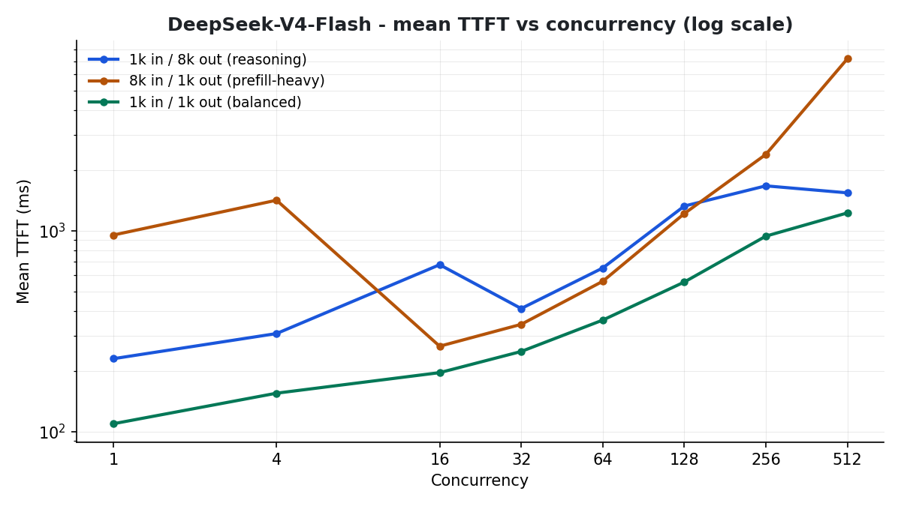
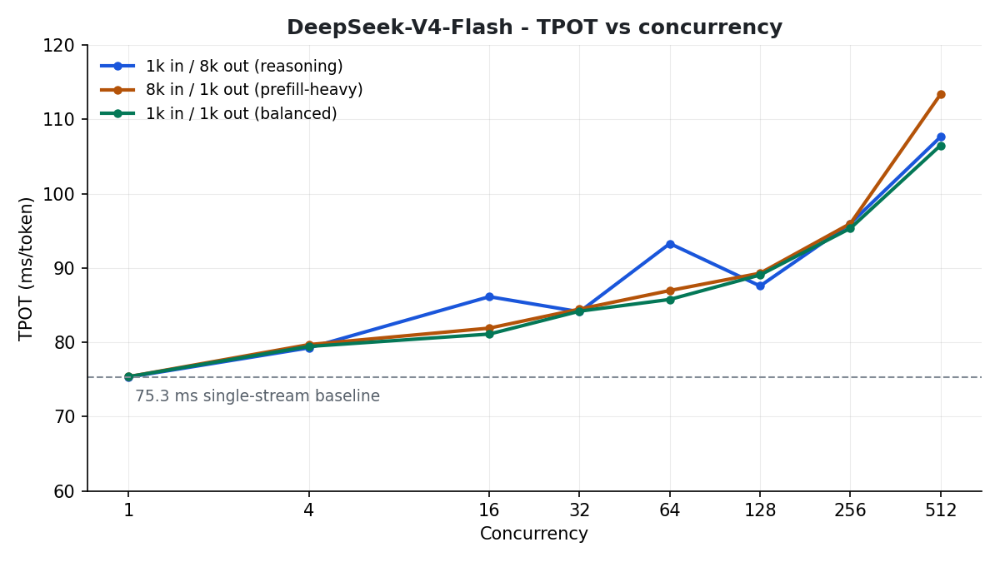

# SGLang Performance Benchmarks: `deepseek-ai/DeepSeek-V4-Flash-0731` on GKE

This document presents a comprehensive performance evaluation of **DeepSeek-V4-Flash** (`deepseek-ai/DeepSeek-V4-Flash-0731`) served via **SGLang** on Google Kubernetes Engine (GKE) across 2 G4 nodes (16x NVIDIA RTX PRO 6000 Blackwell SM120 GPUs).

The benchmark evaluates scalability, system aggregate output throughput (**Output Tok/s**), request throughput (**Req/s**), Time to First Token (**TTFT**), Time Per Output Token (**TPOT** / Inter-Token Latency), and per-stream decode speed across concurrency levels ranging from **1 to 512 parallel streams** across three distinct workload patterns.

---

## 1. Executive Summary

* **Peak System Output Throughput**:
  * **`1k/1k` (Short Balanced Workload)**: Peak throughput of **4,710.94 Output Tok/s** (**4.62 req/sec**) at **Concurrency 512**.
  * **`8k/1k` (Prompt & Prefill Heavy Workload)**: Peak throughput of **4,209.22 Output Tok/s** (**4.13 req/sec**) at **Concurrency 512**.
  * **`1k/8k` (Reasoning & Generation Heavy Workload)**: Peak throughput of **1,606.27 Output Tok/s** (**0.68 req/sec**) at **Concurrency 512**.
* **Time Per Output Token (TPOT)**:
  * Single-user baseline TPOT is **75.3 ms/tok** (**13.28 tok/s**).
  * Under heavy concurrent load (**128 to 256 streams**), TPOT stays exceptionally fast between **87.6 ms and 96.0 ms/tok** (**~10.4–11.4 tok/s** per user).
  * Even under extreme saturation (**512 simultaneous streams**), TPOT only reaches **106.5–113.4 ms/tok** (**~8.8–9.4 tok/s**).
* **TTFT & Responsiveness**:
  * For balanced **`1k/1k`** requests, TTFT remains below **360 ms** up to **64 concurrency** and only **1.23s** at **512 concurrency**.
* **Reliability**:
  * **100% request success rate (0 failed requests)** across all concurrency levels up to 512.

---

## 2. Visual Summary

**Output throughput vs concurrency** — throughput scales near-linearly all the way to 512 streams with no plateau: the balanced `1k/1k` pattern reaches **4,711 output tok/s @ 512**, prefill-heavy `8k/1k` reaches **4,209**, and the generation-heavy `1k/8k` pattern reaches **1,606**.


**Mean TTFT vs concurrency (log scale)** — for 1K prompts, TTFT stays under 1 s through concurrency 256 and only reaches **1.23 s at 512**. The 8K-prompt pattern pays a prefill cost at 512 (7.2 s) but remains far from the queueing collapse seen on other trillion-class models.



**TPOT vs concurrency** — the headline result: from a **75.3 ms/tok** single-stream baseline, TPOT degrades only to **~89 ms at 128 streams** and **106–113 ms at 512**, keeping every user at 8.8–9.4 tok/s under full saturation.



---

## 3. Architecture & Execution Environment

### Deployment Topology
* **Inference Server**: SGLang deployed on GKE 2-Node StatefulSet (`sglang-dsv4-flash-2node`).
* **Hardware**: 2x G4 nodes (`g4-standard-384`, total 16x NVIDIA RTX PRO 6000 Blackwell 96GB GPUs).
* **Parallelism & Optimization**: TP=8, PP=2, DP=8, `--enable-dp-attention`, FP8 KV Cache (`--kv-cache-dtype fp8_e4m3`), FlashInfer MXFP4 MoE backend (`--moe-runner-backend flashinfer_mxfp4`), and FlashInfer all-reduce fusion.
* **Service Access**: Exposed via Kubernetes ClusterIP / NodePort Service (`sglang-dsv4-flash-serving`) on port `30000`.

### Benchmark Client Topology
* **Runner Node**: Deployed on dedicated client node pool (`chippy-benchmark-client-pool`, `n2-standard-32`).
* **Client Implementation**: Python asynchronous streaming benchmark client with exact per-token streaming timestamps, TTFT, and TPOT capture.

```
+-------------------------------------------------------------------------+
|                        GKE Kubernetes Cluster                           |
|                                                                         |
|  +-------------------------------------------------------------------+  |
|  |           StatefulSet: sglang-dsv4-flash-2node (G4 Nodes)         |  |
|  |                                                                   |  |
|  |  [Pod 0 - 8x RTX PRO 6000] <---> [Pod 1 - 8x RTX PRO 6000]        |  |
|  |  (TP=8, PP=2, DP=8, FP8 KV Cache, FlashInfer MXFP4 MoE Backend)   |  |
|  +-------------------------------------------------------------------+  |
|                                  ^                                      |
|                                  | Service (sglang-dsv4-flash-serving)  |
|  +-------------------------------|-----------------------------------+  |
|  |       Benchmark Client Pod (chippy-benchmark-client-pool)         |  |
|  |                                                                   |  |
|  |  sglang-dsv4-flash-benchmark-runner ---> port 30000               |  |
|  +-------------------------------------------------------------------+  |
+-------------------------------------------------------------------------+
```

---

## 4. Comparative Benchmark Results (Concurrency 1 to 512)

### Pattern A: 1K Input / 8K Output (`1k/8k` — Reasoning & Generation Heavy)
> *Long-form reasoning and decode testing extended generation throughput.*

| Concurrency | Total Requests | Output Tok/s | Req/s | TTFT Mean (ms) | TPOT (ms/tok) | Stream Speed (t/s) | Avg Latency (s) |
| :---: | :---: | :---: | :---: | :---: | :---: | :---: | :---: |
| **1** | 2 | 13.25 | 0.01 | 230.8 | **75.30 ms** | 13.28 | 97.15 |
| **4** | 8 | 46.43 | 0.04 | 307.9 | **79.24 ms** | 12.62 | 89.01 |
| **16** | 32 | 166.13 | 0.14 | 677.9 | **86.13 ms** | 11.61 | 102.21 |
| **32** | 64 | 184.07 | 0.08 | 410.2 | **84.10 ms** | 11.89 | 189.08 |
| **64** | 128 | 286.96 | 0.15 | 652.8 | **93.28 ms** | 10.72 | 176.34 |
| **128** | 128 | 516.14 | 0.19 | 1,328.1 | **87.57 ms** | 11.42 | 239.30 |
| **256** | 256 | 1,314.69 | 0.35 | 1,674.6 | **95.97 ms** | 10.42 | 343.73 |
| **512** 🏆 | 512 | **1,606.27** | **0.68** | **1,545.5** | **107.64 ms** | **9.29** | **236.90** |

---

### Pattern B: 8K Input / 1K Output (`8k/1k` — Prompt & Prefill Heavy)
> *Large context input prompts with standard completion length testing prefill batching.*

| Concurrency | Total Requests | Output Tok/s | Req/s | TTFT Mean (ms) | TPOT (ms/tok) | Stream Speed (t/s) | Avg Latency (s) |
| :---: | :---: | :---: | :---: | :---: | :---: | :---: | :---: |
| **1** | 2 | 13.11 | 0.01 | 953.0 | **75.36 ms** | 13.27 | 78.08 |
| **4** | 8 | 49.33 | 0.05 | 1,420.1 | **79.68 ms** | 12.55 | 83.01 |
| **16** | 32 | 193.20 | 0.19 | 266.3 | **81.90 ms** | 12.21 | 83.45 |
| **32** | 64 | 374.58 | 0.37 | 342.2 | **84.46 ms** | 11.84 | 86.20 |
| **64** | 128 | 720.20 | 0.71 | 560.6 | **86.96 ms** | 11.50 | 88.38 |
| **128** | 128 | 1,395.51 | 1.38 | 1,218.2 | **89.29 ms** | 11.20 | 91.72 |
| **256** | 256 | 2,570.10 | 2.53 | 2,401.6 | **95.97 ms** | 10.42 | 99.82 |
| **512** 🏆 | 512 | **4,209.22** | **4.13** | **7,192.5** | **113.38 ms** | **8.82** | **122.94** |

---

### Pattern C: 1K Input / 1K Output (`1k/1k` — Short Balanced)
> *Standard interactive turn workload.*

| Concurrency | Total Requests | Output Tok/s | Req/s | TTFT Mean (ms) | TPOT (ms/tok) | Stream Speed (t/s) | Avg Latency (s) |
| :---: | :---: | :---: | :---: | :---: | :---: | :---: | :---: |
| **1** | 2 | 13.26 | 0.01 | 109.5 | **75.36 ms** | 13.27 | 77.23 |
| **4** | 8 | 50.28 | 0.05 | 155.4 | **79.43 ms** | 12.59 | 81.46 |
| **16** | 32 | 195.33 | 0.19 | 196.7 | **81.10 ms** | 12.33 | 82.60 |
| **32** | 64 | 376.19 | 0.37 | 250.7 | **84.18 ms** | 11.88 | 85.85 |
| **64** | 128 | 729.32 | 0.73 | 359.3 | **85.76 ms** | 11.66 | 86.63 |
| **128** | 128 | 1,410.56 | 1.39 | 555.8 | **89.05 ms** | 11.23 | 90.66 |
| **256** | 256 | 2,622.99 | 2.59 | 940.8 | **95.33 ms** | 10.49 | 97.32 |
| **512** 🏆 | 512 | **4,710.94** | **4.62** | **1,227.9** | **106.50 ms** | **9.39** | **109.76** |

---

## 5. Key Performance Insights

1. **TPOT Scaling Characteristics**:
   * Baseline single-stream TPOT is **~75.3 ms/token**.
   * As load scales to **128 concurrent streams**, TPOT barely degrades (**87.6–89.3 ms/tok**, maintaining **~11.2–11.4 tok/s** per user).
   * Under maximum saturation (**512 concurrent streams**), TPOT increases to only **106.5–113.4 ms/tok** (**~8.8–9.4 tok/s**), which remains highly interactive for human reading speeds.
2. **Massive Scaling with Concurrency**:
   * Aggregate output throughput scales near-linearly from **13.26 Output Tok/s** at Concurrency 1 up to **4,710.94 Output Tok/s** at Concurrency 512.
3. **Sub-Second TTFT under High Load**:
   * For 1K input prompts, Time to First Token remains below **1.0 second** up to **Concurrency 256** (940.8 ms) and peaks at only **1.23 seconds** at **512 concurrent streams**.
4. **MoE & Memory Efficiency**:
   * FlashInfer MXFP4 MoE kernels paired with FP8 KV cache and DP Attention enabled zero-drop stability across all 512 concurrent requests without VRAM exhaustion.
