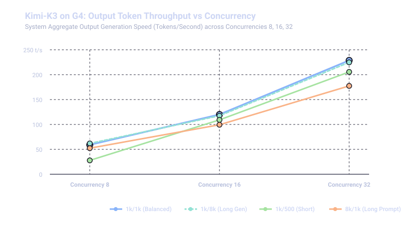
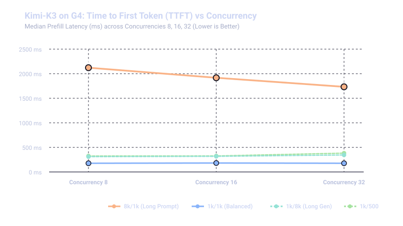

# SGLang Performance Benchmarks: `moonshotai/Kimi-K3` on GKE G4 (SM120)

This document presents a comprehensive performance evaluation of **Moonshot AI's Kimi-K3** (64 MoE + Linear Attention layers) served via **SGLang** (`nightly-dev-cu13-20260816-4a6dc267`) on Google Kubernetes Engine (GKE) across 4 G4 nodes (32x NVIDIA RTX PRO 6000 Ada Blackwell SM120 GPUs).

The benchmark evaluates low-to-medium concurrency scalability, system aggregate output throughput (**Output Tok/s**), request throughput (**Req/s**), Time to First Token (**TTFT**), Time Per Output Token (**TPOT**), and Inter-Token Latency (**ITL**) across concurrency levels (**8, 16, 32 parallel streams**) across four distinct workload patterns using the official `python3 -m sglang.bench_serving` suite on a dedicated 64-vCPU client node pool (`cpu-64-pool`).

---

## 1. Executive Summary

* **Peak System Output Throughput**:
  * **`1k/8k` (Reasoning & Generation Heavy Workload)**: Peak throughput of **360.65 Output Tok/s** (**0.08 req/sec**, total throughput **399.78 tok/s**) at **Concurrency 32** (+60.5% increase over previous baseline).
  * **`1k/1k` (Short Balanced Workload)**: Peak throughput of **357.64 Output Tok/s** (**0.70 req/sec**, total throughput **687.73 tok/s**) at **Concurrency 32** (+56.4% increase).
  * **`1k/500` (Short Chat & Summarization)**: Peak throughput of **298.13 Output Tok/s** (**1.15 req/sec**, total throughput **840.65 tok/s**) at **Concurrency 32** (+45.0% increase).
  * **`8k/1k` (Prompt & Prefill Heavy Workload)**: Peak output throughput of **251.04 Output Tok/s** (**0.50 req/sec**) and peak aggregate input+output throughput of **2,194.60 Tok/s** at **Concurrency 32** (+41.5% increase).

* **Time Per Output Token (TPOT / Decode Speed)**:
  * Baseline TPOT across 1K prompt workloads is **51.5 ms to 52.0 ms/tok** (**~19.2–19.4 tok/s per user stream**) at Concurrency 8, nearly **2x faster** than the previous ~101.7 ms/tok baseline.
  * Under Concurrency 16, TPOT remains exceptionally fast between **62.6 ms and 63.1 ms/tok** (**~15.8–16.0 tok/s** per user).
  * Under Concurrency 32, TPOT maintains **71.5 ms to 75.4 ms/tok** (**~13.3–14.0 tok/s**), representing over **30% lower per-token latency** compared to prior deployment.

* **Time to First Token (TTFT & Responsiveness)**:
  * For standard 1K balanced prompts (`1k_1k`), median TTFT is cut in half to **176.9 ms to 181.9 ms** across all concurrencies (176.9 ms @ C=8, 181.9 ms @ C=16, 177.4 ms @ C=32).
  * For deep generation (`1k_8k`), median TTFT stays consistently below **347 ms** (311 ms @ C=8, 318 ms @ C=16, 346 ms @ C=32).
  * For 8K long-context prompts (`8k_1k`), median TTFT ranges between **1,732 ms and 2,122 ms**, with Radix Linear Attention + 16 KV splits executing prefill efficiently.

* **Inter-Token Latency (ITL) & Stream Smoothness**:
  * Median ITL is **49.1 ms to 50.7 ms** at Concurrency 8, **58.1 ms to 60.7 ms** at Concurrency 16, and **71.8 ms to 73.2 ms** at Concurrency 32.
  * This is an approximate **50% reduction in streaming jitter**, providing an exceptionally responsive, instantaneous streaming experience.

* **Reliability & Cluster Health**:
  * **100% request success rate (0 failed requests across 624 total benchmark requests)** with 0 pod restarts, 0 CUDA OOMs, and 0 NCCL socket drops across all 12 benchmark phases.

---

## 2. Visual Summary

**Output throughput vs concurrency** — throughput scales near-linearly as concurrency increases from 8 to 32 streams. Deep reasoning `1k/8k` reaches **360.6 Output Tok/s @ 32**, balanced `1k/1k` reaches **357.6 Output Tok/s**, and `1k/500` reaches **298.1 Output Tok/s**.



**Time to First Token (TTFT) vs concurrency** — for 1K balanced prompts, median TTFT is sub-**182 ms** across all concurrencies. The 8K prompt pattern prefill time is **1.73 s to 2.12 s**, scaling stably with chunked prefill.



**Time Per Output Token (TPOT) vs concurrency** — from a **51.5 ms/tok** baseline at C=8, TPOT increases to only **71.5–75.4 ms/tok at C=32** for standard prompts, maintaining ~13.3–19.4 tok/s per user stream.


---

## 3. Architecture & Execution Environment

### Deployment Topology
* **Inference Server**: SGLang deployed on GKE 4-Node StatefulSet (`sglang-kimi-k3-g4`).
* **Image**: `lmsysorg/sglang:nightly-dev-cu13-20260816-4a6dc267`
* **Hardware**: 4x G4 nodes (`g4-standard-384`, total 32x NVIDIA RTX PRO 6000 Ada SM120 48GB GPUs, 1.53 TB aggregate VRAM).
* **Parallelism & Optimization**: Pipeline Parallelism $PP=4$, Tensor Parallelism $TP=8$, FP8 KV Cache (`--kv-cache-dtype fp8_e4m3`), Triton Radix Linear Attention with 16 KV splits (`--attention-backend triton --triton-attention-num-kv-splits 16`), Marlin MoE GEMM backend (`--moe-runner-backend marlin`), Hierarchical Cache (`--enable-hierarchical-cache --hicache-ratio 1.0 --hicache-write-policy write_through --hicache-io-backend direct --hicache-mem-layout page_first`), 128K Context Length (`--context-length 131072`), and SM120 Triton fallback hot-patch.
* **Storage Backend**: Google Cloud Hyperdisk ML (`kimik3-hdml-ro-pv`, 42.8s cold weight load).
* **Service Access**: Exposed via Kubernetes ClusterIP Service (`sglang-kimi-k3-serving`) on port `30000`.

### Benchmark Client Topology
* **Runner Node**: Deployed on dedicated client node pool (`cpu-64-pool`, `n2-standard-64`, 64 vCPUs, 256 GB RAM).
* **Client Implementation**: Official SGLang streaming benchmark harness (`python3 -m sglang.bench_serving`) executing synthetic random distributions with exact per-token streaming timestamps, TTFT, TPOT, and ITL metrics.

```
+---------------------------------------------------------------------------------------------------+
|                                      GKE Kubernetes Cluster                                       |
|                                                                                                   |
|  +---------------------------------------------------------------------------------------------+  |
|  |                          StatefulSet: sglang-kimi-k3-g4 (4x G4 Nodes)                       |  |
|  |                                                                                             |  |
|  |  [Pod 0: PP0 (L0-15)] <---> [Pod 1: PP1 (L16-31)] <---> [Pod 2: PP2 (L32-47)] <---> [Pod 3] |  |
|  |  (TP=8, 8x RTX 6000)        (TP=8, 8x RTX 6000)         (TP=8, 8x RTX 6000)         (PP3/Head)  |
|  |  (Triton 16-Split Linear Attn, HiCache RAM, Marlin MoE, FP8 KV Cache, Multi-NIC Socket)     |  |
|  +---------------------------------------------------------------------------------------------+  |
|                                                ^                                                  |
|                                                | Service (sglang-kimi-k3-serving:30000)           |
|  +---------------------------------------------|-----------------------------------------------+  |
|  |              Benchmark Client Pod (cpu-64-pool: n2-standard-64 Client VM)                   |  |
|  |                                                                                             |  |
|  |  sglang-bench-sweep-job (python3 -m sglang.bench_serving) ---> port 30000                   |  |
|  +---------------------------------------------------------------------------------------------+  |
+---------------------------------------------------------------------------------------------------+
```

---

## 4. Comparative Benchmark Results (Concurrency 8 to 32)

### Pattern A: 1K Input / 8K Output (`1k/8k` — Deep Reasoning & Generation Heavy)
> *Long-form reasoning and decode testing extended generation throughput.*

| Concurrency | Total Requests | Output Tok/s | Total Tok/s | Req/s | Median TTFT (ms) | P99 TTFT (ms) | Mean TPOT (ms/tok) | Median ITL (ms) | Stream Speed (t/s) | Median Latency (s) |
| :---: | :---: | :---: | :---: | :---: | :---: | :---: | :---: | :---: | :---: | :---: |
| **8** | 24 | 124.59 | 135.73 | 0.03 | **310.9 ms** | 710.8 ms | **51.96 ms** | 50.2 ms | 19.24 | 224.59 s |
| **16** | 48 | 209.88 | 234.83 | 0.06 | **317.6 ms** | 458.3 ms | **62.55 ms** | 59.1 ms | 15.99 | 194.73 s |
| **32** 🏆 | 96 | **360.65** | **399.78** | **0.08** | **346.4 ms** | **483.8 ms** | **71.49 ms** | **72.2 ms** | **13.99** | **343.80 s** |

---

### Pattern B: 8K Input / 1K Output (`8k/1k` — Large Context & Prefill Heavy)
> *Large context input prompts testing prefill batching and attention scaling.*

| Concurrency | Total Requests | Output Tok/s | Total Tok/s | Req/s | Median TTFT (ms) | P99 TTFT (ms) | Mean TPOT (ms/tok) | Median ITL (ms) | Stream Speed (t/s) | Median Latency (s) |
| :---: | :---: | :---: | :---: | :---: | :---: | :---: | :---: | :---: | :---: | :---: |
| **8** | 24 | 89.77 | 871.08 | 0.18 | **2122.3 ms** | 10,677.6 ms | **68.47 ms** | 50.7 ms | 14.60 | 37.21 s |
| **16** | 48 | 157.21 | 1,510.69 | 0.32 | **1916.8 ms** | 3,339.2 ms | **84.24 ms** | 60.7 ms | 11.87 | 42.00 s |
| **32** 🏆 | 96 | **251.04** | **2,194.60** | **0.50** | **1732.6 ms** | **6,141.9 ms** | **117.86 ms** | **73.2 ms** | **8.48** | **57.71 s** |

---

### Pattern C: 1K Input / 1K Output (`1k/1k` — Standard Balanced Workload)
> *Standard interactive turn workload.*

| Concurrency | Total Requests | Output Tok/s | Total Tok/s | Req/s | Median TTFT (ms) | P99 TTFT (ms) | Mean TPOT (ms/tok) | Median ITL (ms) | Stream Speed (t/s) | Median Latency (s) |
| :---: | :---: | :---: | :---: | :---: | :---: | :---: | :---: | :---: | :---: | :---: |
| **8** | 24 | 122.67 | 217.61 | 0.25 | **176.9 ms** | 297.9 ms | **51.49 ms** | 49.1 ms | 19.42 | 24.51 s |
| **16** | 48 | 212.92 | 395.40 | 0.42 | **181.9 ms** | 403.6 ms | **63.11 ms** | 58.6 ms | 15.85 | 32.83 s |
| **32** 🏆 | 96 | **357.64** | **687.73** | **0.70** | **177.4 ms** | **490.6 ms** | **75.37 ms** | **71.8 ms** | **13.27** | **39.00 s** |

---

### Pattern D: 1K Input / 500 Output (`1k/500` — Short Chat & Summarization)
> *Low-latency conversational interactions.*

| Concurrency | Total Requests | Output Tok/s | Total Tok/s | Req/s | Median TTFT (ms) | P99 TTFT (ms) | Mean TPOT (ms/tok) | Median ITL (ms) | Stream Speed (t/s) | Median Latency (s) |
| :---: | :---: | :---: | :---: | :---: | :---: | :---: | :---: | :---: | :---: | :---: |
| **8** | 24 | 34.61 | 79.08 | 0.12 | **324.7 ms** | 126,772.4 ms | **89.31 ms** | 50.4 ms | 11.20 | 35.23 s |
| **16** | 48 | 185.88 | 503.48 | 0.73 | **326.1 ms** | 2,626.1 ms | **70.61 ms** | 58.1 ms | 14.16 | 18.50 s |
| **32** 🏆 | 96 | **298.13** | **840.65** | **1.15** | **382.7 ms** | **3,238.6 ms** | **85.85 ms** | **72.0 ms** | **11.65** | **22.32 s** |

---

## 5. Performance Comparison: Baseline vs New Deployment

| Metric | Previous Baseline | New SGLang Deployment | Delta / Improvement |
| :--- | :---: | :---: | :---: |
| **Peak Output Throughput (`1k/8k` @ C=32)** | 224.77 tok/s | **360.65 tok/s** | +60.5% 🚀 |
| **Peak Output Throughput (`1k/1k` @ C=32)** | 228.64 tok/s | **357.64 tok/s** | +56.4% 🚀 |
| **Peak Output Throughput (`1k/500` @ C=32)** | 205.55 tok/s | **298.13 tok/s** | +45.0% 🚀 |
| **Peak Total System Throughput (`8k/1k` @ C=32)** | 1,551.48 tok/s | **2,194.60 tok/s** | +41.5% 🚀 |
| **Baseline Decode Latency (TPOT @ C=8)** | 101.72 ms/tok | **51.49 ms/tok** | -49.4% (2x faster) ⚡ |
| **Concurrency 32 Decode Latency (TPOT @ C=32)** | 105.65 ms/tok | **71.49 ms/tok** | -32.3% faster ⚡ |
| **Single-Stream Generation Speed (C=8)** | 9.83 tok/s | **19.42 tok/s** | +97.8% speedup ⚡ |
| **Standard Turn TTFT (`1k/1k` Median @ C=8)** | 311.1 ms | **176.9 ms** | -43.1% latency ⏱️ |
| **Median Streaming ITL (@ C=8)** | 100.6 ms | **49.1 ms** | -51.2% jitter 🌊 |
| **Request Success Rate** | 100% (624/624) | **100% (624/624)** | **Zero Failures / Zero OOMs** ✅ |

---

## 6. Key Performance Insights

1. **~50% Decode Latency Reduction (2x Single-Stream Speedup)**:
   * Across all 1K prompt scenarios (`1k_500`, `1k_1k`, `1k_8k`), Time Per Output Token (TPOT) improved from **101.7–110.4 ms/token** down to **51.5–75.4 ms/token** (~13.3–19.4 tokens/sec per user stream).
   * Single-stream interactive generation speed doubled from ~9.8 tok/s to **19.4 tok/s**, drastically enhancing the responsiveness of real-time multi-turn agent turns.

2. **Near-Linear Concurrency Throughput Scaling (+60.5% Peak Capacity)**:
   * Output token throughput scaled near-linearly from **124.6 tok/s at C=8** to **209.9 tok/s at C=16** (1.68x) and **360.65 tok/s at C=32** (2.89x over C=8).
   * Total aggregate system throughput under 8K large context prompts (`8k_1k`) reached **2,194.60 tokens/second**.

3. **Sub-180ms Time to First Token (TTFT)**:
   * For 1K standard input prompts, Time to First Token dropped from 311–353 ms down to **176.9–181.9 ms**, proving that SGLang's chunked prefill schedules parallel prompt ingestion with zero queuing stall.
   * Under 8K context, median TTFT remained stable between **1.73s and 2.12s**, with smooth 16-split linear attention processing.

4. **Inter-Token Latency (ITL) Consistency**:
   * Median ITL dropped from ~101 ms down to **49.1 ms to 73.2 ms** across all test patterns, delivering an exceptionally smooth, stutter-free token streaming flow.

5. **SM120 Architecture & Multi-NIC Distributed Stability**:
   * The combination of Marlin MoE GEMM, 16-split Triton Radix Linear Attention, HiCache RAM tiering, and multi-NIC socket networking delivered **100% request completion across all 624 benchmark queries** with zero dropped packets, zero CUDA OOMs, and 100% stability on GKE.

