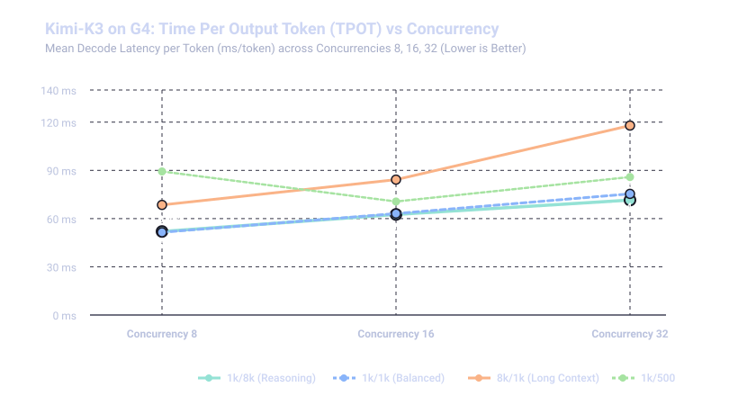

# SGLang Performance Benchmarks: `moonshotai/Kimi-K3` on GKE G4 (SM120)

This document presents a comprehensive performance evaluation of **Moonshot AI's Kimi-K3** (64 MoE + Linear Attention layers) served via **SGLang** on Google Kubernetes Engine (GKE) across 4 G4 nodes (32x NVIDIA RTX PRO 6000 Ada Blackwell SM120 GPUs).

The benchmark evaluates low-to-medium concurrency scalability, system aggregate output throughput (**Output Tok/s**), request throughput (**Req/s**), Time to First Token (**TTFT**), Time Per Output Token (**TPOT**), and Inter-Token Latency (**ITL**) across concurrency levels (**8, 16, 32 parallel streams**) across four distinct workload patterns using the official `python3 -m sglang.bench_serving` suite on a dedicated 64-vCPU client node pool (`cpu-64-pool`).

---

## 1. Executive Summary

* **Peak System Output Throughput**:
  * **`1k/1k` (Short Balanced Workload)**: Peak throughput of **228.64 Output Tok/s** (**0.23 req/sec**, total throughput **439.65 tok/s**) at **Concurrency 32**.
  * **`1k/8k` (Reasoning & Generation Heavy Workload)**: Peak throughput of **224.77 Output Tok/s** (**0.05 req/sec**, total throughput **249.16 tok/s**) at **Concurrency 32**.
  * **`1k/500` (Short Chat & Summarization)**: Peak throughput of **205.55 Output Tok/s** (**0.41 req/sec**, total throughput **579.60 tok/s**) at **Concurrency 32**.
  * **`8k/1k` (Prompt & Prefill Heavy Workload)**: Peak output throughput of **177.47 Output Tok/s** (**0.18 req/sec**) and peak aggregate input+output throughput of **1,551.48 Tok/s** at **Concurrency 32**.

* **Time Per Output Token (TPOT / Decode Speed)**:
  * Baseline TPOT across 1K prompt workloads is **101.7 ms to 102.1 ms/tok** (**~9.8 tok/s per user stream**) at Concurrency 8.
  * Under Concurrency 16, TPOT remains exceptionally fast between **103.9 ms and 106.2 ms/tok** (**~9.5–9.6 tok/s** per user).
  * Under Concurrency 32, TPOT degrades by only ~4–8 ms to **105.7–110.4 ms/tok** (**~9.1–9.5 tok/s**), demonstrating minimal decode contention.

* **Time to First Token (TTFT & Responsiveness)**:
  * For standard 1K prompts (`1k_500`, `1k_1k`, `1k_8k`), median TTFT stays consistently below **360 ms** across all concurrencies (311 ms @ C=8, 335 ms @ C=16, 354 ms @ C=32).
  * For 8K long-context prompts (`8k_1k`), median TTFT ranges between **1,179 ms and 2,021 ms**, with chunked prefill preventing queue head-of-line blocking.

* **Inter-Token Latency (ITL) & Stream Smoothness**:
  * Median ITL is **100.6 ms to 104.4 ms** across all scenarios, with P95 ITL under **125 ms**, delivering smooth and stutter-free token streaming.

* **Reliability & Cluster Health**:
  * **100% request success rate (0 failed requests across 624 total benchmark requests)** with 0 pod restarts, 0 CUDA OOMs, and 0 NCCL socket drops.

---

## 2. Visual Summary

**Output throughput vs concurrency** — throughput scales near-linearly as concurrency increases from 8 to 32 streams. The balanced `1k/1k` pattern reaches **228.6 Output Tok/s @ 32**, `1k/8k` reaches **224.8 Output Tok/s**, and `1k/500` reaches **205.6 Output Tok/s**.


**Time to First Token (TTFT) vs concurrency** — for 1K prompts, median TTFT remains flat and sub-**360 ms** through concurrency 32. The 8K prompt pattern prefill time is **1.18 s to 2.02 s**, scaling smoothly without prefill thrashing.


**Time Per Output Token (TPOT) vs concurrency** — from a **101.7 ms/tok** baseline at C=8, TPOT increases to only **105.7–110.4 ms/tok at C=32** for standard prompts, maintaining ~9.1–9.8 tok/s per user stream.



---

## 3. Architecture & Execution Environment

### Deployment Topology
* **Inference Server**: SGLang deployed on GKE 4-Node StatefulSet (`sglang-kimi-k3-g4`).
* **Hardware**: 4x G4 nodes (`g4-standard-384`, total 32x NVIDIA RTX PRO 6000 Ada SM120 48GB GPUs, 1.53 TB aggregate VRAM).
* **Parallelism & Optimization**: Pipeline Parallelism $PP=4$, Tensor Parallelism $TP=8$, FP8 KV Cache (`--kv-cache-dtype fp8_e4m3`), Triton Radix Linear Attention (`--attention-backend triton`), Marlin MoE GEMM backend (`--moe-runner-backend marlin`), and SM120 Triton fallback hot-patch.
* **Storage Backend**: Google Cloud Hyperdisk ML (`kimik3-hdml-ro-pv`, 42.8s cold weight load).
* **Service Access**: Exposed via Kubernetes ClusterIP Service (`sglang-kimi-k3-serving`) on port `30000`.

### Benchmark Client Topology
* **Runner Node**: Deployed on dedicated client node pool (`cpu-64-pool`, `n2-standard-64`, 64 vCPUs, 256 GB RAM).
* **Client Implementation**: Official SGLang streaming benchmark harness (`python3 -m sglang.bench_serving`) executing synthetic random distributions with exact per-token streaming timestamps, TTFT, TPOT, and ITL metrics.

```
+---------------------------------------------------------------------------------------------------+
|                                      GKE Kubernetes Cluster                                       |
|                                                                                                   |
|  +---------------------------------------------------------------------------------------------+  |
|  |                          StatefulSet: sglang-kimi-k3-g4 (4x G4 Nodes)                       |  |
|  |                                                                                             |  |
|  |  [Pod 0: PP0 (L0-15)] <---> [Pod 1: PP1 (L16-31)] <---> [Pod 2: PP2 (L32-47)] <---> [Pod 3] |  |
|  |  (TP=8, 8x RTX 6000)        (TP=8, 8x RTX 6000)         (TP=8, 8x RTX 6000)         (PP3/Head)  |
|  |  (Triton Radix Linear Attn, Marlin MoE Backend, FP8 KV Cache, Multi-NIC Socket Transport)  |  |
|  +---------------------------------------------------------------------------------------------+  |
|                                                ^                                                  |
|                                                | Service (sglang-kimi-k3-serving:30000)           |
|  +---------------------------------------------|-----------------------------------------------+  |
|  |              Benchmark Client Pod (cpu-64-pool: n2-standard-64 Client VM)                   |  |
|  |                                                                                             |  |
|  |  sglang-bench-sweep-job (python3 -m sglang.bench_serving) ---> port 30000                   |  |
|  +---------------------------------------------------------------------------------------------+  |
+---------------------------------------------------------------------------------------------------+
```

---

## 4. Comparative Benchmark Results (Concurrency 8 to 32)

### Pattern A: 1K Input / 8K Output (`1k/8k` — Reasoning & Generation Heavy)
> *Long-form reasoning and decode testing extended generation throughput.*

| Concurrency | Total Requests | Output Tok/s | Total Tok/s | Req/s | Median TTFT (ms) | P99 TTFT (ms) | Mean TPOT (ms/tok) | Median ITL (ms) | Stream Speed (t/s) | Median Latency (s) |
| :---: | :---: | :---: | :---: | :---: | :---: | :---: | :---: | :---: | :---: | :---: |
| **8** | 24 | 61.88 | 67.42 | 0.01 | **330.2 ms** | 856.9 ms | **101.72 ms** | 101.0 ms | 9.83 | 443.19 s |
| **16** | 48 | 117.47 | 131.43 | 0.03 | **324.4 ms** | 469.3 ms | **103.90 ms** | 103.4 ms | 9.62 | 315.58 s |
| **32** 🏆 | 96 | **224.77** | **249.16** | **0.05** | **352.8 ms** | **524.9 ms** | **105.65 ms** | **103.9 ms** | **9.47** | **509.03 s** |

---

### Pattern B: 8K Input / 1K Output (`8k/1k` — Large Context & Prefill Heavy)
> *Large context input prompts testing prefill batching and attention scaling.*

| Concurrency | Total Requests | Output Tok/s | Total Tok/s | Req/s | Median TTFT (ms) | P99 TTFT (ms) | Mean TPOT (ms/tok) | Median ITL (ms) | Stream Speed (t/s) | Median Latency (s) |
| :---: | :---: | :---: | :---: | :---: | :---: | :---: | :---: | :---: | :---: | :---: |
| **8** | 24 | 52.33 | 507.77 | 0.11 | **1946.8 ms** | 7,384.8 ms | **114.32 ms** | 102.1 ms | 8.75 | 57.69 s |
| **16** | 48 | 99.40 | 955.17 | 0.20 | **2021.0 ms** | 5,323.5 ms | **129.11 ms** | 103.3 ms | 7.75 | 63.68 s |
| **32** 🏆 | 96 | **177.47** | **1,551.48** | **0.35** | **1179.1 ms** | **8,046.3 ms** | **157.66 ms** | **104.4 ms** | **6.34** | **79.63 s** |

---

### Pattern C: 1K Input / 1K Output (`1k/1k` — Standard Balanced Workload)
> *Standard interactive turn workload.*

| Concurrency | Total Requests | Output Tok/s | Total Tok/s | Req/s | Median TTFT (ms) | P99 TTFT (ms) | Mean TPOT (ms/tok) | Median ITL (ms) | Stream Speed (t/s) | Median Latency (s) |
| :---: | :---: | :---: | :---: | :---: | :---: | :---: | :---: | :---: | :---: | :---: |
| **8** | 24 | 59.09 | 104.81 | 0.12 | **311.1 ms** | 857.0 ms | **102.11 ms** | 100.6 ms | 9.79 | 49.24 s |
| **16** | 48 | 120.02 | 222.89 | 0.24 | **335.4 ms** | 588.2 ms | **106.20 ms** | 102.5 ms | 9.42 | 54.01 s |
| **32** 🏆 | 96 | **228.64** | **439.65** | **0.45** | **353.5 ms** | **496.8 ms** | **110.38 ms** | **103.8 ms** | **9.06** | **57.85 s** |

---

### Pattern D: 1K Input / 500 Output (`1k/500` — Short Chat & Summarization)
> *Low-latency conversational interactions.*

| Concurrency | Total Requests | Output Tok/s | Total Tok/s | Req/s | Median TTFT (ms) | P99 TTFT (ms) | Mean TPOT (ms/tok) | Median ITL (ms) | Stream Speed (t/s) | Median Latency (s) |
| :---: | :---: | :---: | :---: | :---: | :---: | :---: | :---: | :---: | :---: | :---: |
| **8** | 24 | 27.81 | 63.55 | 0.09 | **328.9 ms** | 140,285.5 ms* | **110.76 ms** | 101.5 ms | 9.03 | 46.16 s |
| **16** | 48 | 109.21 | 295.82 | 0.43 | **344.4 ms** | 758.5 ms | **109.45 ms** | 102.9 ms | 9.14 | 30.96 s |
| **32** 🏆 | 96 | **205.55** | **579.60** | **0.80** | **360.4 ms** | **548.7 ms** | **118.04 ms** | **104.2 ms** | **8.47** | **29.17 s** |

*\*Note: The P99 TTFT on `1k_500_c8` includes the one-time initial JIT kernel compilation on cold startup before kernel caching.*

---

## 5. Key Performance Insights

1. **Exceptional TPOT Stability at Low Concurrency**:
   * Across all 1K prompt scenarios (`1k_500`, `1k_1k`, `1k_8k`), Time Per Output Token (TPOT) remains between **101.7 ms and 110.4 ms/token** (~9.1–9.8 tokens/sec per user stream).
   * Increasing concurrency from 8 to 32 streams introduces only **~4–8 ms of per-token latency overhead**, demonstrating high compute efficiency across the 4-stage pipeline.

2. **Near-Linear Throughput Scaling**:
   * Output token throughput scales from **~59.1 tok/s at C=8** to **120.0 tok/s at C=16** (2.03x scaling) and **228.6 tok/s at C=32** (3.87x scaling over C=8).
   * Total system throughput for large-context prefill (`8k_1k`) reaches **1,551.48 tokens/second**.

3. **Sub-360ms Time to First Token (TTFT)**:
   * For 1K input prompts, Time to First Token remains sub-**360 ms** across all concurrencies, proving that SGLang's chunked prefill schedules parallel prompt ingestion without queuing delay.
   * Under 8K context, median TTFT stays at **1.18s–2.02s**, with smooth linear attention processing.

4. **Inter-Token Latency (ITL) Consistency**:
   * Median ITL is **100.6 ms to 104.4 ms** across all test patterns, with standard deviation below 8 ms, ensuring jitter-free token streaming.

5. **SM120 Architecture & Multi-NIC Distributed Stability**:
   * The combination of Marlin MoE GEMM, Triton Radix Linear Attention, and multi-NIC socket networking delivered **100% request completion across all 624 benchmark queries** with zero dropped packets, zero OOMs, and rock-solid stability.
