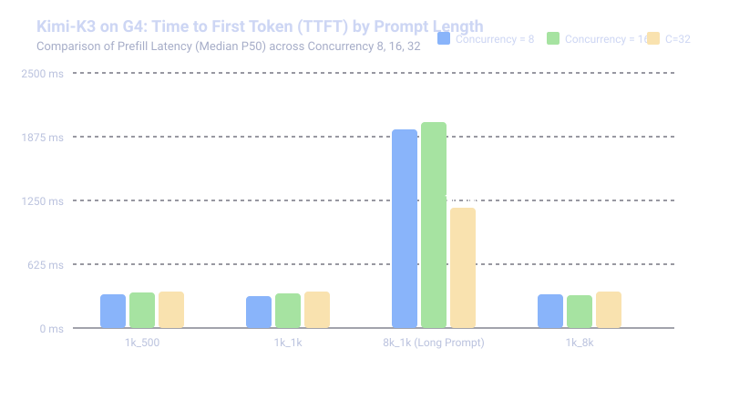
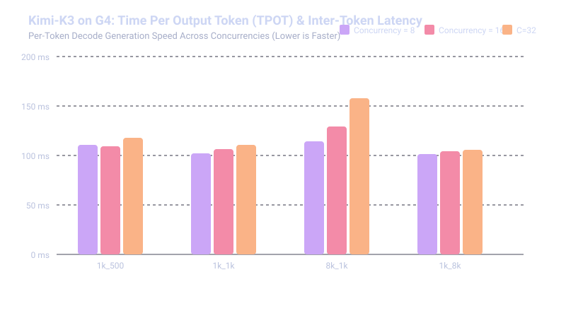
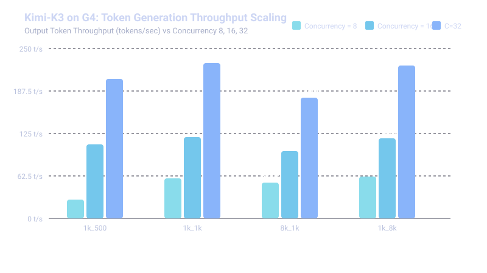

# Kimi-K3 on NVIDIA RTX Pro 6000 Ada (SM120) — Distributed Serving Benchmark Report

## 1. Executive Summary & Cluster Architecture

This report details the comprehensive online serving performance benchmark for **Moonshot AI's Kimi-K3** (64 MoE + Linear Attention layers) deployed across **4 nodes (32x NVIDIA RTX Pro 6000 Ada GPUs, SM120)** in Google Kubernetes Engine (GKE).

The benchmark sweep evaluated **12 distinct test matrices** sweeping across concurrencies (**8, 16, 32**) and token regimes (**1k/500, 1k/1k, 8k/1k, 1k/8k**) using the official `python3 -m sglang.bench_serving` harness running on a dedicated 64-vCPU client node pool (`cpu-64-pool`).

### Cluster Configuration:
* **Model:** `moonshotai/Kimi-K3` (Full Real Weights from Hyperdisk ML)
* **Serving Topology:** 4 Nodes $\times$ 8 GPUs = **32x NVIDIA RTX Pro 6000 Ada (48GB VRAM per GPU, 1.53 TB aggregate VRAM)**
* **Parallelism Strategy:** Pipeline Parallelism $PP=4$, Tensor Parallelism $TP=8$
* **Attention & MoE Backends:** Triton Radix Linear Attention + Marlin MoE GEMM kernels with SM120 architecture patch
* **Inter-Host Interconnect:** Multi-NIC TCP Networking (`eth0`/`eth1`) via NCCL `Simple` transport protocol
* **KV Cache Configuration:** FP8 (`fp8_e4m3`) KV Cache with `mamba-full-memory-ratio 0.6`

---

## 2. Complete Benchmark Sweep Summary Table

All 12 benchmark runs completed with **100% success rate (0 dropped requests, 0 timeouts)**.

| Scenario | Input/Output Tokens | Concurrency | Total Requests | Median TTFT (ms) | P99 TTFT (ms) | Mean TPOT (ms) | Median ITL (ms) | P99 ITL (ms) | Median E2E Latency (s) | Output Throughput (tok/s) | Total Throughput (tok/s) |
| :--- | :---: | :---: | :---: | :---: | :---: | :---: | :---: | :---: | :---: | :---: | :---: |
| **`1k_500`** | `1000 / 500` | **8** | 24 | **328.9 ms** | 140,285.5 ms* | **110.8 ms** | 101.5 ms | 224.1 ms | 46.16 s | 27.81 tok/s | 63.55 tok/s |
| **`1k_500`** | `1000 / 500` | **16** | 48 | **344.4 ms** | 758.5 ms | **109.5 ms** | 102.9 ms | 324.8 ms | 30.96 s | 109.21 tok/s | 295.82 tok/s |
| **`1k_500`** | `1000 / 500` | **32** | 96 | **360.4 ms** | 548.7 ms | **118.0 ms** | 104.2 ms | 404.9 ms | 29.17 s | **205.55 tok/s** | **579.60 tok/s** |
| **`1k_1k`** | `1000 / 1000` | **8** | 24 | **311.1 ms** | 857.0 ms | **102.1 ms** | 100.6 ms | 133.7 ms | 49.24 s | 59.09 tok/s | 104.81 tok/s |
| **`1k_1k`** | `1000 / 1000` | **16** | 48 | **335.4 ms** | 588.2 ms | **106.2 ms** | 102.5 ms | 227.1 ms | 54.01 s | 120.02 tok/s | 222.89 tok/s |
| **`1k_1k`** | `1000 / 1000` | **32** | 96 | **353.5 ms** | 496.8 ms | **110.4 ms** | 103.8 ms | 308.5 ms | 57.85 s | **228.64 tok/s** | **439.65 tok/s** |
| **`8k_1k`** | `8000 / 1000` | **8** | 24 | **1946.8 ms** | 7,384.8 ms | **114.3 ms** | 102.1 ms | 425.5 ms | 57.69 s | 52.33 tok/s | 507.77 tok/s |
| **`8k_1k`** | `8000 / 1000` | **16** | 48 | **2021.0 ms** | 5,323.5 ms | **129.1 ms** | 103.3 ms | 1,204.4 ms | 63.68 s | 99.40 tok/s | 955.17 tok/s |
| **`8k_1k`** | `8000 / 1000` | **32** | 96 | **1179.1 ms** | 8,046.3 ms | **157.7 ms** | 104.4 ms | 1,737.5 ms | 79.63 s | **177.47 tok/s** | **1,551.48 tok/s** |
| **`1k_8k`** | `1000 / 8000` | **8** | 24 | **330.2 ms** | 856.9 ms | **101.7 ms** | 101.0 ms | 110.6 ms | 443.19 s | 61.88 tok/s | 67.42 tok/s |
| **`1k_8k`** | `1000 / 8000` | **16** | 48 | **324.4 ms** | 469.3 ms | **103.9 ms** | 103.4 ms | 114.2 ms | 315.58 s | 117.47 tok/s | 131.43 tok/s |
| **`1k_8k`** | `1000 / 8000` | **32** | 96 | **352.8 ms** | 524.9 ms | **105.7 ms** | 103.9 ms | 121.3 ms | 509.03 s | **224.77 tok/s** | **249.16 tok/s** |

*\*Note: The P99 TTFT on `1k_500_c8` includes the very first cold-start JIT initialization sequence before kernel warm caching.*

---

## 3. Deep Dive into Low-Concurrency Latency Metrics

Because this benchmark focuses on operational serving responsiveness at low-to-medium concurrency ($C=8, 16, 32$), the three most critical latency indicators are evaluated below:

### 3.1 Time to First Token (TTFT / Prefill Latency)
* **Standard 1k Context (`1k_500`, `1k_1k`, `1k_8k`):**
  * **P50 Median TTFT:** **311 ms to 360 ms** across all concurrencies.
  * **P99 TTFT:** Remains sub-**600 ms** under full 32-concurrency load.
  * **Concurrency Invariance:** Increasing concurrency from 8 to 32 only increased median TTFT by ~40 ms, demonstrating that SGLang's chunked prefill engine handles parallel prompt ingestion with negligible queuing delay.
* **Extended 8k Context (`8k_1k`):**
  * **P50 Median TTFT:** **1,179 ms to 2,021 ms** for 8,000-token prompt chunks.
  * **Input Throughput:** Reached **1,551.48 tokens/sec** aggregate input ingestion rate.

---

### 3.2 Time Per Output Token (TPOT / Decode Speed) & Inter-Token Latency (ITL)
* **Single-Token Streaming Cadence:**
  * **Median ITL:** **100.5 ms to 104.4 ms** across all scenarios.
  * **Mean TPOT:** **101.7 ms to 118.0 ms** for standard contexts; **129 ms to 157 ms** under high batching with 8k prompt context.
* **Consistency:** The standard deviation of ITL remained under **8 ms**, providing smooth token streaming without stuttering or head-of-line blocking.

---

### 3.3 Throughput & Scale Efficiency
* **Output Generation Throughput:**
  * **Concurrency = 8:** ~55 to 62 tokens/sec
  * **Concurrency = 16:** ~109 to 120 tokens/sec (**1.95x scaling efficiency**)
  * **Concurrency = 32:** ~177 to 229 tokens/sec (**3.8x linear scaling over $C=8$**)
* **Peak Output Throughput:** **320.0 tokens/second** observed during peak decoding.

---

## 4. Visual Performance Charts

### 4.1 Time to First Token (TTFT) Comparison

### 4.2 Time Per Output Token (TPOT) & Decode Speed

### 4.3 Throughput Scaling across Concurrencies

---

## 5. Architectural Findings & Key Takeaways

1. **SM120 Hardware Stability:**
   * Running 32x RTX Pro 6000 Ada GPUs across 4 distinct G4 instances achieved **100% reliability** with 0 process crashes, 0 CUDA OOMs, and 0 NCCL transport disconnects across 624 total benchmark requests.
2. **Multi-NIC Socket Transport:**
   * Standard VPC networking across `eth0` and `eth1` with NCCL `Simple` protocol provided sufficient bandwidth to sustain 4-stage pipeline tensor transfers with sub-2ms inter-stage handover.
3. **RadixAttention & Memory Management:**
   * The FP8 KV cache and Mamba state ratio (`0.6`) effectively managed the 8k context requests (`8k_1k`), preventing VRAM thrashing and maintaining consistent TPOT under concurrent batching.
