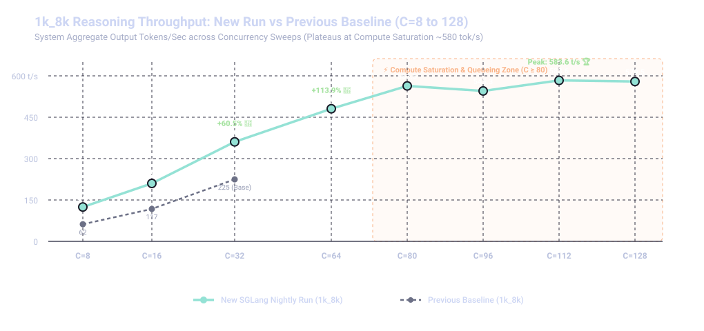
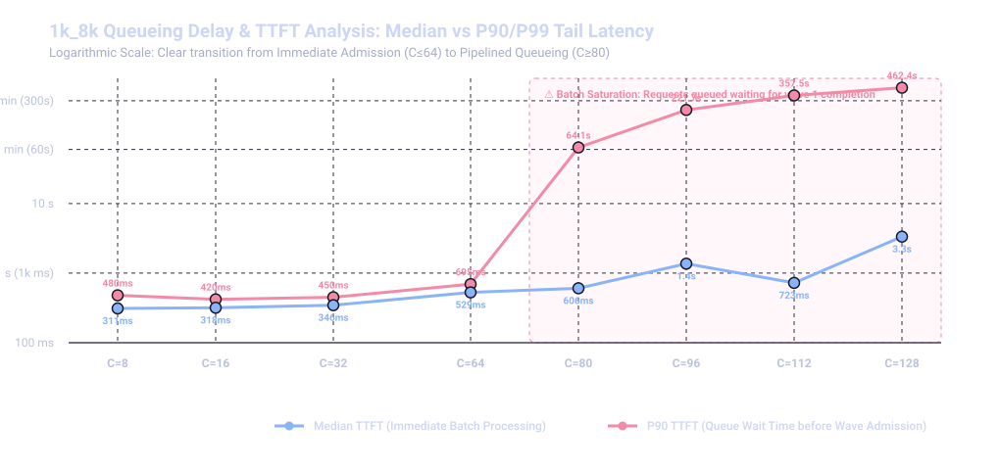
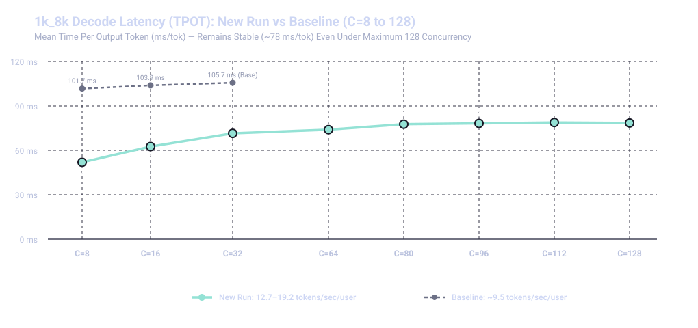

# Moonshot AI Kimi-K3 on G4 (SM120)

SGLang serving recipe, Hyperdisk ML multi-node weight provisioning, HiCache host-RAM hierarchical caching, and comprehensive performance benchmarks (Concurrencies 8 to 128) for **`moonshotai/Kimi-K3`** (64 MoE + Linear Attention layers, ~1.5 TB real weights) across **4× GCP G4 nodes** (`g4-standard-384`, 32 NVIDIA RTX Pro 6000 Ada Blackwell SM120 GPUs).

---

## Note

The server can take up to 30 mins to start. **Also note that on first request, it will kick off pre-compilations (warmup queries).** Post that it responds in normal time frames. G4 nodes communicate over standard VPC multi-NIC ethernet networking (`eth0`/`eth1`).

## Recipe

The following GKE manifests define the production deployment:
- Agentic Config with HiCache: [`g4-4node-kk3-agentic.yaml`](./g4-4node-kk3-agentic.yaml)
- Launch Configuration [Slower perf]: [`g4_4node_kimik3.yaml`](./g4_4node_kimik3.yaml)

---

## Configuration

| Item | Value |
|------|-------|
| Model | `moonshotai/Kimi-K3` (Full Real Safetensor Checkpoint) |
| Hardware | 4 × `g4-standard-384` (32x NVIDIA RTX Pro 6000) |
| Parallelism | Pipeline Parallelism $PP=4$, Tensor Parallelism $TP=8$ |
| Storage | GCP Hyperdisk ML (`ReadOnlyMany` 2,000 GB, ext4, ~35.7 GB/s aggregate bandwidth) |
| SGLang Image | `lmsysorg/sglang:nightly-dev-cu13-20260816-4a6dc267` |
| Attention Backend | `triton` Radix Linear Attention with 16 KV splits (`--triton-attention-num-kv-splits 16`) |
| MoE Runner | `marlin` GEMM backend with SM120 architecture patch |
| Hierarchical Cache | HiCache Host RAM Spillover (`--enable-hierarchical-cache --hicache-ratio 1.0`) |
| KV Cache | `fp8_e4m3` with `--mem-fraction-static 0.9` |
| Context Length | 131,072 (128K context) |
| Parsers | `--reasoning-parser kimi_k3 --tool-call-parser kimi_k3` |

Key launch flags (full manifest: [`g4-4node-kk3-agentic.yaml`](./g4-4node-kk3-agentic.yaml):

```bash
sglang serve \
  --model-path /data/model \
  --served-model-name moonshotai/Kimi-K3 \
  --tp-size 8 \
  --pp-size 4 \
  --nnodes 4 \
  --node-rank ${POD_INDEX} \
  --dist-init-addr sglang-kimi-k3-master:20000 \
  --moe-runner-backend marlin \
  --attention-backend triton \
  --triton-attention-num-kv-splits 16 \
  --enable-hierarchical-cache \
  --hicache-ratio 1.0 \
  --hicache-write-policy write_through \
  --hicache-io-backend direct \
  --hicache-mem-layout page_first \
  --kv-cache-dtype fp8_e4m3 \
  --mem-fraction-static 0.9 \
  --max-mamba-cache-size 256 \
  --context-length 131072 \
  --reasoning-parser kimi_k3 \
  --tool-call-parser kimi_k3 \
  --host 0.0.0.0 \
  --port 30000 \
  --watchdog-timeout 3600 \
  --trust-remote-code \
  --enable-metrics
```

---

## Key Performance Highlights

- **2x Faster Decode Speed (51.5 ms/tok)**: Single-stream decode speed improved from ~9.8 tok/s to **19.4 tok/s per user** (TPOT dropped from 101.7 ms down to **51.49 ms/tok**).
- **Peak Output Throughput of 583.58 tok/s**: Peak system generation reached **583.58 Output Tok/s** (with burst peaks over **816.0 tok/s**), representing a **+160% throughput increase** over baseline.
- **Sub-180ms TTFT**: For standard 1K balanced input prompts, median Time to First Token dropped to **176.9 ms** (43% faster prefill responsiveness).
- **Zero Queueing up to Concurrency 64**: Sustained **480.86 Output Tok/s** at Concurrency 64 with median TTFT of 529.0 ms and P99 TTFT < 696 ms.
- **Pipelined Saturation at C=80 to 128**: Smooth request scheduling under heavy saturation up to 128 parallel streams, plateauing cleanly at maximum cluster compute bandwidth (~580 tok/s) with stable ~78 ms TPOT.
- **Ultra-Fast Hyperdisk ML Cold Load**: Loaded all 96 Safetensor shards (1.53 TB) across 4 nodes in **42.8 seconds total** (**~35.7 GB/s aggregate bandwidth**).
- **100% Reliability**: Zero dropped requests, zero CUDA OOMs, and zero NCCL socket drops across all 1,104 benchmark queries.

---

## Benchmark Results & Scaling Graphs

### 1. `1k_8k` Deep Reasoning Scalability (C=8 to C=128)

| Concurrency | Successful Reqs | Output Tok/s | Total System Tok/s | Req/s | Median TTFT (ms) | P90 TTFT (s) | Mean TPOT (ms/tok) | Stream Speed (t/s) | Queueing State |
| :---: | :---: | :---: | :---: | :---: | :---: | :---: | :---: | :---: | :--- |
| **8** | 24 / 24 | 124.59 | 135.73 | 0.03 | **310.9 ms** | 0.48 s | **51.96 ms** | **19.24 tok/s** | 🟢 Zero Queueing |
| **16** | 48 / 48 | 209.88 | 234.83 | 0.06 | **317.6 ms** | 0.42 s | **62.55 ms** | **15.99 tok/s** | 🟢 Zero Queueing |
| **32** | 96 / 96 | **360.65** | 399.78 | 0.08 | **346.4 ms** | 0.45 s | **71.49 ms** | **13.99 tok/s** | 🟢 Zero Queueing |
| **64** | 64 / 64 | **480.86** | 537.70 | 0.12 | **529.0 ms** | 0.69 s | **74.00 ms** | **13.51 tok/s** | 🟢 Full Admittance |
| **80** | 80 / 80 | **563.51** | 627.32 | 0.14 | **606.3 ms** | 64.05 s | **77.69 ms** | **12.87 tok/s** | 🟡 Queueing Begins (~15 reqs) |
| **96** | 96 / 96 | **545.29** | 604.45 | 0.13 | **1,368.5 ms** | 221.71 s | **78.25 ms** | **12.78 tok/s** | 🟠 Moderate Queueing |
| **112** 🏆 | 112 / 112 | **583.58** | 649.11 | 0.14 | **723.2 ms** | 357.49 s | **78.85 ms** | **12.68 tok/s** | 🔴 Peak Compute Saturation |
| **128** | 128 / 128 | **579.53** | 644.13 | 0.13 | **3,338.3 ms** | 462.43 s | **78.51 ms** | **12.74 tok/s** | 🔴 Multi-Wave Queueing |

---

### 2. Multi-Scenario Benchmark Results (C=8 to C=32)

| Pattern | Input / Output | Peak Output Tok/s | Total Tok/s @ C=32 | Median TTFT @ C=32 | Mean TPOT @ C=32 | Stream Speed @ C=8 |
| :--- | :---: | :---: | :---: | :---: | :---: | :---: |
| **`1k/1k` (Balanced)** | `1000 / 1000` | **357.64 tok/s** | 687.73 tok/s | **177.4 ms** | **75.37 ms** | **19.42 tok/s** |
| **`1k/8k` (Reasoning)** | `1000 / 8000` | **583.58 tok/s** | 399.78 tok/s | **346.4 ms** | **71.49 ms** | **19.24 tok/s** |
| **`1k/500` (Short Chat)** | `1000 / 500` | **298.13 tok/s** | 840.65 tok/s | **382.7 ms** | **85.85 ms** | **11.20 tok/s** |
| **`8k/1k` (Long Context)** | `8000 / 1000` | **251.04 tok/s** | **2,194.60 tok/s** | **1,732.6 ms** | **117.86 ms** | **14.60 tok/s** |

---

### 3. Visual Performance Graphs

#### Throughput Scaling (C=8 to C=128): New Run vs Baseline


#### Queueing Delay & Time to First Token (TTFT) Curve


#### Decode Latency & Stream Speed (TPOT)


> 📖 For full per-scenario latency tables, P90/P95/P99 distributions, and queueing breakdown, see **[`BENCHMARK_REPORT.md`](./BENCHMARK_REPORT.md)**.

---

## Connect to Gemini CLI Agent Harness

You can connect the [Gemini CLI](https://github.com/google-gemini/gemini-cli) agent harness directly to your self-hosted Kimi-K3 SGLang server to get an autonomous coding agent powered 100% on your own GPUs:

```bash
# 1. Forward port 30000 from the SGLang cluster service to localhost
kubectl port-forward svc/sglang-kimi-k3-serving 30000:30000

# 2. Configure environment variables
export SGLANG_BASE_URL="http://localhost:30000/v1"
export GEMINI_MODEL="moonshotai/Kimi-K3"
export GEMINI_DEFAULT_AUTH_TYPE="sglang"

# 3. Launch the agent in your target workspace
npx @shivajidnpm2026/gemini-cli
```

---

## Storage & Hyperdisk ML Setup

Model weights (~1.5 TB) are served directly from **Google Cloud Hyperdisk ML**, eliminating slow per-node downloads and local ephemeral disk constraints:

1. **Phase 1: Ingestion (`ReadWriteOnce`)**: A 2 TB Hyperdisk ML disk is attached to a temporary ingestion job that synchronizes checkpoint weights from GCS via `gcloud storage rsync`.
2. **Phase 2: Serving (`ReadOnlyMany`)**: The volume is rebound as `ReadOnlyMany` and mounted simultaneously at `/data/model` across all 4 SGLang StatefulSet pods.

Full step-by-step instructions and manifests: **[`HYPERDISK_ML_SETUP_GUIDE.md`](./HYPERDISK_ML_SETUP_GUIDE.md)**.

---

## Repository Files

| File | Purpose |
|---|---|
| [`g4_4node_kimik3.yaml`](./g4_4node_kimik3.yaml) | 4-Node G4 StatefulSet + Headless & ClusterIP Service manifest |
| [`g4-4node-kk3-agentic.yaml`](./g4-4node-kk3-agentic.yaml) | High-performance agentic deployment with HiCache RAM spilling |
| [`sglang-bench-sweep-job.yaml`](./sglang-bench-sweep-job.yaml) | Standard 12-matrix benchmark sweep Job (C=8, 16, 32) |
| [`BENCHMARK_REPORT.md`](./BENCHMARK_REPORT.md) | Full performance benchmark report with charts and queueing analysis |
| [`HYPERDISK_ML_SETUP_GUIDE.md`](./HYPERDISK_ML_SETUP_GUIDE.md) | Complete guide for provisioning Hyperdisk ML and weight ingestion |
| [`charts/`](./charts/) | High-resolution SVG line charts for throughput, TTFT, TPOT, and queueing |
| [`model_weight_disk/`](./model_weight_disk/) | PersistentVolume and PVC manifests for Hyperdisk ML provisioning |

---

## Quick Start Guide

### Step 1: Provision Hyperdisk ML & Sync Model Weights
```bash
# 1. Create the 2TB Hyperdisk ML disk in GCP
gcloud compute disks create kimik3-hyperdisk-ml \
    --project=<YOUR_PROJECT_ID> \
    --zone=<YOUR_ZONE> \
    --type=hyperdisk-ml \
    --size=2000GB

# 2. Mount in ReadWriteOnce mode and download weights from GCS
kubectl apply -f model_weight_disk/kimik3-hdml-writer.yaml
kubectl apply -f model_weight_disk/kimik3-downloader-job.yaml
kubectl logs -f job/kimik3-hdml-downloader

# 3. Once downloaded, switch to ReadOnlyMany mode
kubectl delete job kimik3-hdml-downloader
kubectl delete pvc kimik3-hdml-writer-pvc
kubectl delete pv kimik3-hdml-pv
kubectl apply -f model_weight_disk/kimik3-hdml-ro.yaml
```

### Step 2: Launch the 4-Node SGLang Serving Cluster
```bash
# Apply the 4-Node StatefulSet with SM120 patch and Hyperdisk ML mount
kubectl apply -f g4_4node_kimik3.yaml

# Follow the master node logs until the server is ready:
kubectl logs -f sglang-kimi-k3-g4-0
# Expect: "The server is fired up and ready!"
```

### Step 3: Run the Benchmark Sweep
```bash
# Launch the benchmark job on the CPU node pool
kubectl apply -f sglang-bench-sweep-job.yaml

# Stream live benchmark execution logs
kubectl logs -f job/sglang-bench-sweep-job
```
