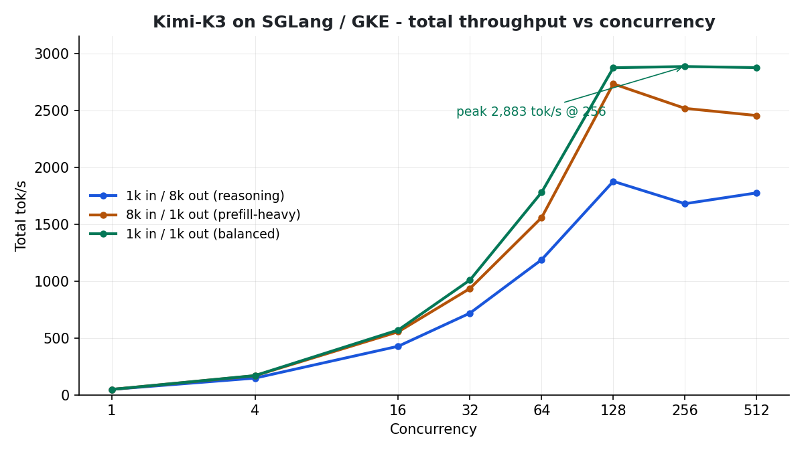
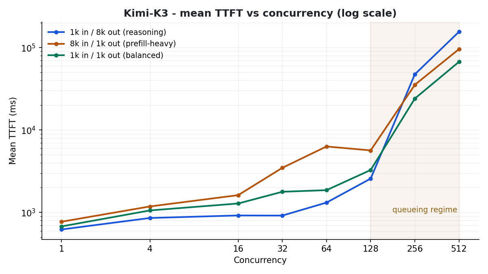
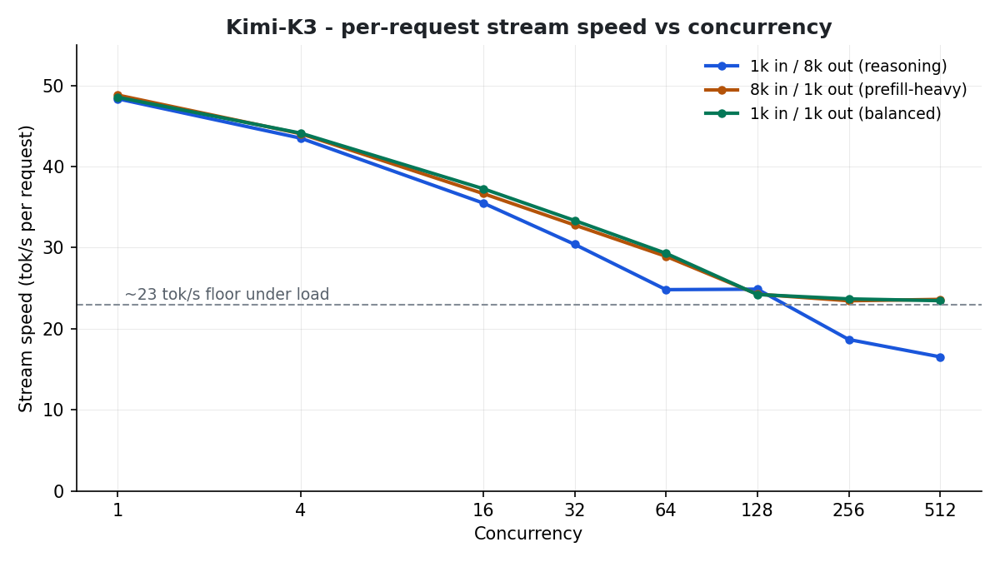

# SGLang Performance Benchmarks: `moonshotai/Kimi-K3` on GKE

This document presents a comprehensive performance evaluation of the **Kimi-K3** (`moonshotai/Kimi-K3`) large reasoning model served via **SGLang** on Google Kubernetes Engine (GKE).

The benchmark evaluates scalability, throughput (tokens/sec and requests/sec), Time to First Token (TTFT), and per-request streaming generation speed across concurrency levels ranging from **1 to 512 parallel requests** across three distinct workload patterns.

---

## 1. Executive Summary

* **Peak System Throughput**:
  * **`1k/1k` (Balanced Workload)**: Achieved peak throughput of **2,883.45 tok/sec** (**2.82 req/sec**) at **Concurrency 256**.
  * **`8k/1k` (Prompt-Heavy Workload)**: Achieved peak throughput of **2,731.09 tok/sec** (**2.68 req/sec**) at **Concurrency 128**.
  * **`1k/8k` (Reasoning & Generation Workload)**: Achieved peak throughput of **1,874.86 tok/sec** (**1.03 req/sec**) at **Concurrency 128**.
* **Reliability**: Tested up to **512 concurrent requests** per workload with **100% success rate (0 failed requests)**.
* **Stream Speed**: Even under high concurrency (128–512 simultaneous streams), individual request generation speed remained high at **~23–25 tok/sec**, demonstrating efficient KV-cache and memory bandwidth utilization.

---

## 2. Visual Summary

**Total throughput vs concurrency** — throughput scales near-linearly to concurrency 128, then plateaus as the GPUs saturate. The balanced `1k/1k` pattern peaks at **2,883 tok/s @ 256**; both long-prompt and long-output patterns peak at **128**.



**Mean TTFT vs concurrency (log scale)** — TTFT stays in the low seconds through concurrency 128, then jumps one to two orders of magnitude at 256+ as requests queue for KV-cache blocks. This is queueing, not decode slowdown.



**Per-request stream speed vs concurrency** — a single stream decodes at ~48 tok/s; under 128–512 simultaneous streams, per-user speed settles at ~23–25 tok/s, comfortably above human reading speed.



---

## 3. Architecture & Execution Environment

### Deployment Topology
* **Inference Server**: SGLang deployed on GKE using **LeaderWorkerSet (LWS)** (`sglang-kimi-k3-0`, `0-1`, `0-2`, `0-3`).
* **Model**: `moonshotai/Kimi-K3` running distributed inference across multi-node GPUs with NCCL and FlashInfer optimizations enabled.
* **Service Access**: Exposed via Kubernetes ClusterIP Service (`sglang-kimi-k3-svc`) on port `30100`.

### Benchmark Runner Topology
* **Runner Environment**: Zero-dependency Python asynchronous streaming client (`benchmark_client.py` and `concurrency_sweep.py`).
* **Network Path**: Executed against local port-forwarded endpoint (`http://localhost:30100/v1/chat/completions`).

```
+-------------------------------------------------------------+
|                     GKE Kubernetes Cluster                  |
|                                                             |
|  +-------------------------------------------------------+  |
|  |       LeaderWorkerSet: sglang-kimi-k3                 |  |
|  |                                                       |  |
|  |  [sglang-kimi-k3-0]    <--- Leader Node (Port 30100)  |  |
|  |    |     |     |                                      |  |
|  |  (NCCL / Tensor & Pipeline Parallelism)               |  |
|  |    v     v     v                                      |  |
|  |  [Worker 1]  [Worker 2]  [Worker 3]                   |  |
|  +-------------------------------------------------------+  |
|                              ^                              |
|                              | Service (sglang-kimi-k3-svc) |
+------------------------------|------------------------------+
                               | kubectl port-forward 30100:30100
+------------------------------|------------------------------+
|                     Local Benchmark Runner                  |
|                                                             |
|  concurrency_sweep.py ---> http://localhost:30100           |
+-------------------------------------------------------------+
```

---

## 4. Comparative Benchmark Results (Concurrency 1 to 512)

### Pattern A: 1K Input / 8K Output (`1k/8k` — Reasoning & Generation Heavy)
> *Long-form reasoning and output generation testing extended decode performance.*

| Concurrency | Total Requests | Total Tok/s | Req/s | TTFT Mean (ms) | TTFT P99 (ms) | Stream Speed (t/s) | Avg Latency (s) |
| :---: | :---: | :---: | :---: | :---: | :---: | :---: | :---: |
| **1** | 2 | 47.54 | 0.03 | 622.9 | 658.7 | 48.36 | 36.71 |
| **4** | 8 | 146.58 | 0.10 | 857.7 | 1,064.5 | 43.51 | 35.25 |
| **16** | 32 | 426.60 | 0.22 | 920.5 | 1,087.8 | 35.50 | 54.31 |
| **32** | 64 | 717.45 | 0.37 | 917.8 | 1,253.8 | 30.41 | 64.48 |
| **64** | 128 | 1,186.90 | 0.65 | 1,318.0 | 2,093.0 | 24.82 | 75.48 |
| **128** 🏆 | 128 | **1,874.86** | **1.03** | **2,574.9** | **2,919.9** | **24.88** | **75.30** |
| **256** | 256 | 1,678.56 | 0.92 | 47,396.6 | 142,270.8 | 18.67 | 147.34 |
| **512** | 512 | 1,773.45 | 0.99 | 155,229.8 | 376,148.0 | 16.53 | 267.16 |

---

### Pattern B: 8K Input / 1K Output (`8k/1k` — Prompt & Prefill Heavy)
> *Large context input prompts with standard completion length testing prefill batching.*

| Concurrency | Total Requests | Total Tok/s | Req/s | TTFT Mean (ms) | TTFT P99 (ms) | Stream Speed (t/s) | Avg Latency (s) |
| :---: | :---: | :---: | :---: | :---: | :---: | :---: | :---: |
| **1** | 2 | 47.08 | 0.05 | 773.2 | 803.2 | 48.82 | 21.75 |
| **4** | 8 | 167.66 | 0.16 | 1,183.8 | 1,404.1 | 44.06 | 24.34 |
| **16** | 32 | 553.64 | 0.54 | 1,623.1 | 1,995.8 | 36.67 | 29.40 |
| **32** | 64 | 933.80 | 0.92 | 3,481.9 | 4,422.9 | 32.79 | 34.53 |
| **64** | 128 | 1,556.86 | 1.53 | 6,318.5 | 7,166.3 | 28.93 | 41.57 |
| **128** 🏆 | 128 | **2,731.09** | **2.68** | **5,660.3** | **5,906.3** | **24.26** | **47.72** |
| **256** | 256 | 2,515.91 | 2.47 | 35,331.6 | 61,854.5 | 23.45 | 78.90 |
| **512** | 512 | 2,452.86 | 2.40 | 95,695.4 | 173,666.6 | 23.62 | 139.07 |

---

### Pattern C: 1K Input / 1K Output (`1k/1k` — Short Balanced)
> *Standard conversational or interactive agentic turn workload.*

| Concurrency | Total Requests | Total Tok/s | Req/s | TTFT Mean (ms) | TTFT P99 (ms) | Stream Speed (t/s) | Avg Latency (s) |
| :---: | :---: | :---: | :---: | :---: | :---: | :---: | :---: |
| **1** | 2 | 47.03 | 0.05 | 678.1 | 683.9 | 48.55 | 21.71 |
| **4** | 8 | 168.78 | 0.17 | 1,059.1 | 1,070.1 | 44.13 | 24.18 |
| **16** | 32 | 569.46 | 0.56 | 1,285.5 | 1,655.8 | 37.27 | 28.66 |
| **32** | 64 | 1,008.19 | 0.99 | 1,784.0 | 2,156.0 | 33.35 | 32.41 |
| **64** | 128 | 1,778.91 | 1.74 | 1,865.6 | 2,053.5 | 29.30 | 36.69 |
| **128** | 128 | 2,872.49 | 2.81 | 3,275.4 | 3,656.6 | 24.22 | 45.43 |
| **256** 🏆 | 256 | **2,883.45** | **2.82** | **24,068.0** | **48,850.7** | **23.68** | **67.22** |
| **512** | 512 | 2,873.47 | 2.81 | 67,126.4 | 141,498.9 | 23.46 | 110.72 |

---

## 5. Key Performance Insights

1. **Optimal Operating Envelopes (Sweet Spots)**:
   * **Concurrency 128** is the optimal operating point for latency-sensitive applications across all workload types. At this level, **Time to First Token (TTFT)** remains exceptionally low (**2.5s for 1K prompts** and **5.6s for 8K prompts**), while delivering near-maximum system throughput (**1,875 to 2,872 tok/s**).
   * **Concurrency 256** maximizes raw token throughput for balanced (`1k/1k`) workloads (**2,883 tok/s**), but TTFT increases as requests enter the SGLang batching queue.
2. **Streaming Output Speed Stability**:
   * A single user query streams at **~48 tok/s**.
   * Under heavy concurrent load (**128 to 512 simultaneous streams**), per-user streaming speed only drops to **~23.5–25.0 tok/s**, comfortably above normal human reading speeds.
3. **Queueing Behavior at Concurrency 256+**:
   * When concurrency exceeds 128 on long-generation (`1k/8k`) or long-prompt (`8k/1k`) workloads, total throughput plateaus due to GPU compute saturation, while TTFT grows linearly as incoming requests wait for KV-cache blocks.

---

## 6. Reproducibility & Scripts

To run or re-verify these benchmarks locally against a live GKE deployment:

```bash
# 1. Establish port forwarding to the SGLang Kubernetes Service
PATH=/Users/shivajid/google-cloud-sdk/bin:$PATH kubectl port-forward svc/sglang-kimi-k3-svc 30100:30100 &

# 2. Run the high-concurrency master sweep across all 3 workload patterns
python3 /Users/shivajid/sglang-gke-igw/run_master_sweeps_high_concurrency.py

# 3. Alternatively, run an individual concurrency sweep for a specific workload
python3 /Users/shivajid/sglang-gke-igw/concurrency_sweep.py \
  --endpoint http://localhost:30100 \
  --model moonshotai/Kimi-K3 \
  --concurrency-levels 128,256,512 \
  --input-tokens 1024 \
  --max-tokens 8192 \
  --output-json /Users/shivajid/sglang-gke-igw/sweep_1k_8k_high.json
```

### Reference Artifacts in Repository
* Complete Results JSON (Baseline 1–64): `master_concurrency_sweep_results.json`
* Complete Results JSON (High Concurrency 128–512): `master_concurrency_sweep_high_results.json`
* Benchmark Client Implementation: `benchmark_client.py`
* Sweep Orchestrator: `concurrency_sweep.py`
* Master Multi-Pattern Orchestrator: `run_master_sweeps_high_concurrency.py`

